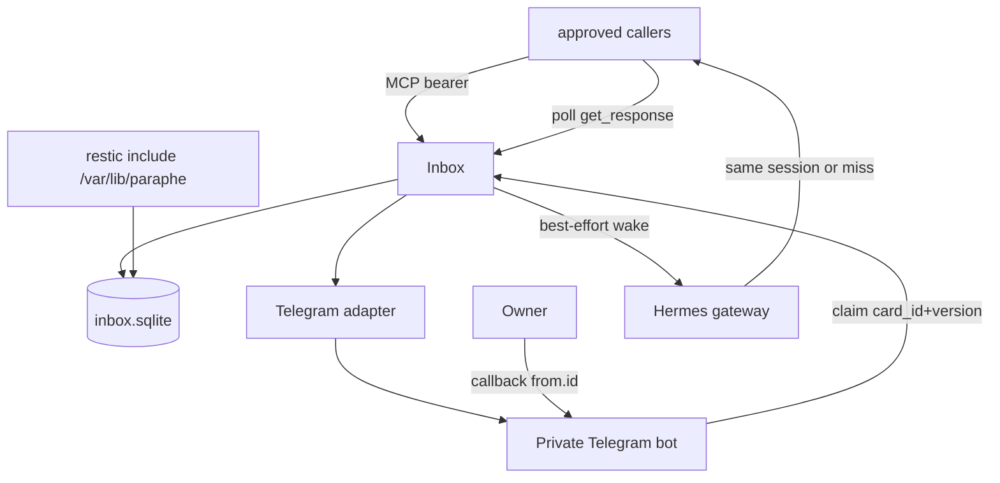

# Paraphe v1 Inbox - Plan

## Goal Capsule

- **Objective:** the owner can decide hard-to-reverse work with one Telegram tap on an inbox he owns, and the asking Hermes session can resume without him announcing the tap.
- **Means:** A self-hosted Inbox module with a MCP surface and a private Telegram tap bot (KTD1, KTD2).
- **Authority:** `docs/specs/paraphe-v1.md` > ADRs 0001–0010 > `CONTEXT.md` > `docs/research/mcp-surface-keep-or-drop.md`.
- **Stop:** Do not implement unattended batch or cron callers. Do not cut the previous inbox over before the proof card. Do not invent a replacement agent. Do not open-source.
- **Execution profile:** Test-first at the Inbox seam. Telegram and Hermes wake stay adapters behind fakes until U4/U5.
- **Tail:** The implementation lane implements; an independent reviewer judges finished packets. The previous inbox stays live until the U7 proof card.

---

## Product Contract

### Summary

Build Paraphe v1: one Inbox that stores Cards, exposes the twelve live MCP tools, and collects Taps in a dedicated Telegram bot private chat. Wake the exact Hermes session when possible; otherwise poll. Flip the approved callers in one owner-approved window after one real high-risk proof card.

### Problem Frame

the previous inbox already collects the tap. The writing contract is good. The risk is vendor lock, lost history, and a tap that does not resume the asking session. Desktop tools are often blocked, so cards leave through a helper with no origin and closeout fails. The owner will not bounce to another app or announce the tap in chat.

### Key Decisions

- Compatible MCP names and reliability fields. Drop iOS extras. (ADR 0001) Governs R8, R9, R10, R11, R15, R26
- Dedicated Telegram private bot is the tap surface. (ADR 0002) Governs R1, R4, R5
- Dual-path wake: store is source of the tap; wake is best-effort; poll is fallback. (ADR 0003, 0006) Governs R6, R7, R18, R19
- SQLite under user `paraphe`, restic include `/var/lib/paraphe`. (ADR 0005) Governs R20, R21
- Default life 4 hours, floor 15 minutes; edit buttons off; bind `callback_data` to card version. (ADR 0007) Governs R2, R3, R12
- File plus env setup; owner-only `/config` never shows the token. (ADR 0008) Governs R22, R23, R24
- One cut, one inbox, one proof card. the batch caller stays on the previous inbox for different work. (ADR 0004, 0009) Governs R27, R28, R29
- Shared MCP bearer creates; owner Telegram id taps. (ADR 0010) Governs R13, R14

### Requirements

**Tap and card life**

- R1. The owner taps Approve or a short choice in the private Telegram bot. Silence is not a tap.
- R2. Default `expires_in_seconds` is 14400. Create below 900 fails. Upper bound is 2592000.
- R3. After tap, cancel, or expiry, edit the bot message and strip the keyboard. A late callback still refuses.
- R4. `callback_data` is opaque, ≤64 bytes, and binds `card_id` plus current `version`. After `update_request`, an old version refuses even if the action matches.
- R5. Only `CallbackQuery.from.id` equal to the configured owner id may tap or run `/config`. Others are ignored.

**Wake and poll**

- R6. A successful wake is the exact Hermes session that sent the card resuming and acting. Do not start a replacement agent.
- R7. Persist one origin: `hermes:session:api_server:<id>`, `hermes:session:telegram:<id>`, or `origin=none` (poll-only). WebUI is a surface, never `platform=webui`. A chat topic is not a wake.

**MCP contract**

- R8. `tools/list` returns exactly the twelve names in `docs/research/mcp-surface-keep-or-drop.md`.
- R9. `ask_question` takes `question`/`context`/`choices`. `request_approval` takes `title`/`details`. Mixing those names fails.
- R10. Duplicate `external_id` returns the same card and does not notify twice.
- R11. `get_response` and `list_unprocessed` show a tap without consuming it. Nested `.response.choice` is the answered signal.
- R12. `update_request` requires `expected_version` and bumps `version`. Stale answers refuse.
- R13. Shared MCP bearer may create cards. The Telegram bot does not create cards for strangers.
- R14. A leaked bearer cannot tap. A stolen Telegram account cannot create via MCP.
- R15. `rule_key` is accepted and ignored. Always-allow, bulk approve, and lock-screen chrome are not product.
- R16. `report_execution.outcome` is only `accepted|rejected|completed|failed`. `mark_processed` is idempotent.
- R17. `cancel_request` reasons are `cancelled|resolved_elsewhere`.
- R18. `notify_user` is status, never a yes/no.
- R19. Agents may keep working after send. Poll remains enough if wake fails.

**Store and setup**

- R20. Live file is `/var/lib/paraphe/inbox.sqlite` mode 0600 owned `paraphe:paraphe`. Snapshot is `/var/lib/paraphe/inbox.sqlite.bak` before daily restic.
- R21. `/var/lib/paraphe` must be on the live restic include list before the proof card. That line is absent today.
- R22. Required start settings: bot token, owner Telegram id, default TTL, floor TTL, and the shared MCP create bearer. File plus env; env wins. Missing required values refuse start. Unauthenticated MCP calls fail.
- R23. Owner-only `/config` may change non-secret knobs. It never displays the current token.
- R24. First start still needs the file or env.

**Cutover**

- R25. Inbox is never source of truth. Agents revalidate live repo and task state before acting.
- R26. Keep field lengths and enums from the inventory file. Telegram tap may add a `responded_via` value later; that is additive.
- R27. the batch caller and crons stay on the previous inbox and may only send batch/git work (its own `project` value).
- R28. One owner-approved window after one real high-risk proof card: tap → same session acts → `report_execution` → `mark_processed`. Notify-only is not that card.
- R29. In that window, the approved callers switch endpoint to Paraphe and behaviour-block the previous inbox. No dual-write. No fallback to the previous inbox.

### Actors

- A1. The owner — sole Owner. Taps and runs `/config`.
- A2. The primary agent — creates cards, polls, reports, marks processed, attempts wake.
- A3. Codex, Claude, Grok launchers — same MCP after the cut; poll-only if they cannot wake.
- A4. the batch caller — stays on the previous inbox; different work only.

### Key Flows

- F1. Approval
  - **Trigger:** A2 or A3 calls `request_approval` with bearer and `external_id`.
  - **Steps:** Inbox persists Card `open`; Telegram adapter sends ELI15 card; owner taps; Inbox records `.response.choice`; optional wake; A2 revalidates; `report_execution`; `mark_processed`.
  - **Covered by:** R1, R8, R9, R11, R16, R25
- F2. Stale revision
  - **Trigger:** A2 calls `update_request`; owner taps an old button.
  - **Steps:** version increments; leftover `callback_data` refuses; no approve.
  - **Covered by:** R4, R12
- F3. Honest miss
  - **Trigger:** Origin session is gone, or create used `origin=none`.
  - **Steps:** No replacement session. Tap stays in SQLite. A2/A3 poll.
  - **Covered by:** R6, R7, R19
- F4. Cutover
  - **Trigger:** Owner approves the flip after the proof card.
  - **Steps:** restic include is live; each harness already proved `tools/list`; switch endpoint; block the previous inbox; the batch caller unchanged.
  - **Covered by:** R21, R27, R28, R29

### Acceptance Examples

- AE1. Covers R10. Given a create with `external_id=x`, when the same create retries, then the same `request_id` returns and Telegram is not notified again.
- AE2. Covers R4, R12. Given an open card at version 1, when `update_request` succeeds and a callback carries version 1, then the claim refuses.
- AE3. Covers R5, R14. Given a callback whose `from.id` is not the owner, when it arrives, then no tap is recorded.
- AE4. Covers R7. Given create with `origin=none`, when the card is stored, then no wake record exists and poll still works.
- AE5. Covers R2. Given create with `expires_in_seconds=60`, when the Inbox validates, then create fails.
- AE6. Covers R28. Given a notify-only ping, when someone treats it as the proof card, then cutover must not proceed.

### Success Criteria

- One Inbox-seam test suite proves create, tap, refuse, poll, report, and mark processed without Telegram or a live Hermes session.
- One real high-risk card completes tap → same session acts → report → mark processed before any the previous inbox flip.
- After the flip, those four callers cannot create on the previous inbox.

### Scope Boundaries

**Deferred for later**

- the batch caller and unattended cron callers on Paraphe
- Per-caller MCP bearers
- A second encrypted backup destination
- Concrete Telegram `responded_via` value beyond “additive”
- Expiry-message cleanup scheduler details (Jude r2 non-blocking)

**Outside this product's identity**

- Mobile-app clone
- Public launch or open-source in v1
- Bulk approve, lock-screen chrome, Always-allow
- Replacing a Telegram chat topic alerts
- Multi-user SaaS
- fallback to the previous inbox after the four callers flip
- GitHub Issues as a tracker

### Sources

- `docs/specs/paraphe-v1.md`
- `docs/adr/0001-compatible-mcp-surface.md` through `docs/adr/0010-bearer-creates-owner-taps.md`
- `docs/research/mcp-surface-keep-or-drop.md`
- `CONTEXT.md`
- Throwaway prototype state machine on `prototype/four-button-expire` (directional only)

---

## Planning Contract

### Key Technical Decisions

- KTD1. One Inbox module owns cards, MCP dispatch, tap claims, closeout, and setup. Telegram and Hermes wake are adapters. (session-settled: user-approved — chosen over three test seams: one Inbox seam is the only unit-test surface)
- KTD2. Language and runtime are not locked by the spec. Prefer one process in the language the implementer can TDD fastest in, with SQLite via a single store port. Do not copy `prototype/four_button_expire.py` into production.
- KTD3. Card states are `open`, `tapped`, `expired`, `cancelled`. A Telegram callback is a claim, not a decision. Cite R3, R4.
- KTD4. Drive unit tests through an Inbox port with a fake Telegram callback and a fake clock/wake. No SQLite row asserts. Cite R8–R19.
- KTD5. Persist origin as `source_thread` plus explicit `origin=none`. Wake writes one gateway session-wake record of the staged the previous inbox bind/wake class. Cite R6, R7.
- KTD6. Paraphe uses a **new** shared bearer, stored like today’s previous MCP key (0600 file or env). Do not reuse the previous inbox secret. Cite R13, R22.
- KTD7. Cutover sequence per harness inside one window: register Paraphe beside the previous inbox with **create tools denied** → prove `tools/list` → proof card from the allowed agent path → switch endpoint → behaviour-block the previous inbox create. Cite R28, R29.
- KTD9. MCP transport keeps Streamable HTTP and SSE so existing launchers need no new client. Listen on loopback or tailnet only, not a public bind. Cite R8.
- KTD8. Host paths `/var/lib/paraphe/*` and the restic include live in the deployment's infrastructure config, not in this repo’s git tree as live state. This repo ships the unit, config example, and snapshot hook contract. Cite R20, R21.

### High-Level Technical Design



```
open + owner + live version + live card → tapped
open + time >= expires_at → expired
update_request → version += 1; old callback_data refuses
any non-open + callback → refuse, no approve
from.id != owner → ignore
```

Directional guidance from the throwaway prototype, not production code.

### Assumptions

- No application code exists on `main`. Greenfield layout in this repo is allowed.
- Homelab restic include edit is a cutover prerequisite ticket, not a product-code unit.
- Exact Python vs Go vs other runtime is an implementation-time choice under KTD2.
- Staged gateway bind/wake shape in the deployment's infrastructure config is the wake record class to reuse, not to vendor as a Hermes core PR.

### Sequencing

U1 store+config → U2 Inbox MCP lifecycle → U3 tap claims → U4 Telegram adapter → U5 wake adapter → U6 host install + restic include → U7 proof card + one-cut flip.

---

## Output Structure

```
src/inbox/           # Inbox module
src/adapters/        # telegram, wake
src/mcp/             # twelve-tool dispatch
tests/inbox/         # one seam
config.example.yml
docs/specs/paraphe-v1.md
```

Implementer may adjust names. Per-unit Files stay authoritative.

---

## Implementation Units

| U-ID | Title | Files touched | Depends-on |
|---|---|---|---|
| U1 | Store and setup | `src/inbox/store`, `config.example.yml`, `tests/inbox/test_setup.py` | — |
| U2 | MCP card lifecycle | `src/mcp`, `src/inbox`, `tests/inbox/test_mcp_lifecycle.py` | U1 |
| U3 | Tap claims and revision | `src/inbox`, `tests/inbox/test_tap_claims.py` | U2 |
| U4 | Telegram adapter | `src/adapters/telegram`, `tests/inbox/test_telegram_port.py` | U3 |
| U5 | Wake adapter | `src/adapters/wake`, `tests/inbox/test_wake_port.py` | U3 |
| U6 | Host paths and restic | the deployment's include list, unit file | U1 |
| U7 | Proof card and one-cut | harness configs, cutover notes | U4, U5, U6 |

### U1. Store and setup

- **Goal:** Process refuses to start without token, owner id, default TTL, and floor TTL. Env wins over file. Store path is ready.
- **Requirements:** R2, R20, R22, R24
- **Dependencies:** none
- **Files:** `config.example.yml`, `src/inbox/config.py` (or equivalent), `src/inbox/store.py`, `tests/inbox/test_setup.py`
- **Approach:** Load file then env. Reject TTL below 900. Require bot token, owner id, TTLs, and the **new** MCP bearer. Do not open a Telegram connection in this unit.
- **Execution note:** Implement new domain behavior test-first.
- **Patterns to follow:** ADR 0005, ADR 0008. Do not commit secrets.
- **Test scenarios:**
  - Missing token refuses start.
  - Missing owner id refuses start.
  - Missing MCP bearer refuses start.
  - Env TTL overrides file TTL.
  - File TTL 60 is rejected.
  - Omitted expiry on later creates will default to 14400 (assert default constant here).
- **Verification:** Setup tests pass. Example config has no real token.

### U2. MCP card lifecycle

- **Goal:** Twelve tools exist. Create, poll, update, cancel, report, and mark processed match the inventory.
- **Requirements:** R8, R9, R10, R11, R12, R15, R16, R17, R18, R22, R26
- **Dependencies:** U1
- **Files:** `src/mcp/`, `src/inbox/card.py`, `tests/inbox/test_mcp_lifecycle.py`
- **Approach:** Cite inventory file for field lengths. Kind split on R9. Nested envelope on R11. `notify_user` does not create a Card.
- **Execution note:** Start with a failing Inbox-seam test for `tools/list` and duplicate `external_id`.
- **Patterns to follow:** `docs/research/mcp-surface-keep-or-drop.md`
- **Test scenarios:**
  - `tools/list` returns exactly twelve names.
  - Duplicate `external_id` returns the same card and does not notify twice. Covers AE1.
  - Question vs approval argument names reject a mix.
  - `get_response` after a recorded tap returns `.response.choice` and does not consume.
  - `update_request` with wrong `expected_version` fails.
  - `report_execution` rejects an unknown outcome.
  - `mark_processed` is idempotent; a read before it still shows the tap.
  - Create without the MCP bearer fails.
  - `rule_key` on create does not 400.
- **Verification:** MCP lifecycle tests pass without Telegram.

### U3. Tap claims and revision

- **Goal:** Only an open card plus owner plus live version becomes a Tap.
- **Requirements:** R1, R3, R4, R5, R14
- **Dependencies:** U2
- **Files:** `src/inbox/claim.py`, `tests/inbox/test_tap_claims.py`
- **Approach:** Callback is a claim. State machine in High-Level Technical Design. Edit/strip is requested through a Telegram port; failure does not authorize.
- **Execution note:** Implement new domain behavior test-first.
- **Patterns to follow:** Prototype transitions; do not import the prototype module.
- **Test scenarios:**
  - Owner + live version on `open` records a tap. Covers R1.
  - Non-owner `from.id` never records a tap. Covers AE3.
  - Expired, cancelled, and already-tapped claims refuse.
  - After `update_request`, previous version refuses. Covers AE2.
  - Clock past `expires_at` moves `open` to `expired` before a claim is accepted.
- **Verification:** Claim tests pass with a fake Telegram port.

### U4. Telegram adapter

- **Goal:** Private bot sends ELI15 cards, answers every callback, strips keyboards, and ignores non-owner `/config` and messages.
- **Requirements:** R1, R3, R5, R13, R23
- **Dependencies:** U3
- **Files:** `src/adapters/telegram/`, `tests/inbox/test_telegram_port.py`
- **Approach:** Adapter translates Bot API updates into Inbox claims. `/config` changes non-secrets only and never echoes the token. Strangers messaging the bot do not create cards.
- **Execution note:** Prefer adapter tests with a fake Bot API. One optional live smoke is out of unit scope.
- **Patterns to follow:** ADR 0002, ADR 0007, ADR 0008
- **Test scenarios:**
  - Send path builds `callback_data` with card id and version.
  - Non-owner `/config` is ignored and token is absent from any reply.
  - On close, adapter is asked to edit and strip; Inbox still refuses if a late claim arrives after edit failure.
  - Incoming text from a stranger does not call create.
- **Verification:** Adapter tests pass. No bot token in repo.

### U5. Wake adapter

- **Goal:** Persist origin correctly and attempt one gateway wake. Miss is honest.
- **Requirements:** R6, R7, R19
- **Dependencies:** U3
- **Files:** `src/adapters/wake/`, `tests/inbox/test_wake_port.py`
- **Approach:** Map Desktop/WebUI to `api_server`. Map Telegram Hermes to `telegram`. `origin=none` writes no wake. Dead session returns miss; card stays pollable.
- **Execution note:** Fake the gateway. Do not call live Hermes in unit tests.
- **Patterns to follow:** ADR 0006; staged gateway bind/wake record class
- **Test scenarios:**
  - Desktop/WebUI create stores `hermes:session:api_server:<id>`.
  - Telegram Hermes create stores `hermes:session:telegram:<id>`.
  - `origin=none` stores no wake record. Covers AE4.
  - Wake of a missing session is a miss; `get_response` still returns the tap.
- **Verification:** Wake-port tests pass.

### U6. Host paths and restic include

- **Goal:** Host has user `paraphe`, `/var/lib/paraphe`, snapshot hook, and restic include. Repo stays code-only.
- **Requirements:** R20, R21
- **Dependencies:** U1
- **Files:** the deployment's include list (and installed `the backup service's include list`); unit/snapshot hook owned by the deployment's infrastructure config
- **Approach:** Add `/var/lib/paraphe` to the include list. Snapshot to `inbox.sqlite.bak` before `the daily backup service`. Do not exclude that path. Do not put live cards in git.
- **Execution note:** This is packaging/config; prefer install/runtime smoke over unit coverage.
- **Test expectation:** none in this repo — reason: host IaC. Prove with a restic dry-run listing `/var/lib/paraphe` after the include lands.
- **Verification:** Include line exists in tracked IaC and on the box. Snapshot file appears after a backup hook dry-run.

### U7. Proof card and one-cut flip

- **Goal:** One real high-risk Paraphe card completes the lifecycle. Then the four callers flip in one window.
- **Requirements:** R25, R27, R28, R29
- **Dependencies:** U4, U5, U6
- **Files:** harness MCP configs (Hermes default, Codex, Claude, Grok launchers); cutover notes under `docs/`
- **Approach:** Cite KTD7. Register Paraphe with create denied until the proof card. the batch caller stays on the previous inbox with its own `project` value. Notify-only is not the proof card. Covers AE6. Do not reuse the previous inbox bearer (KTD6).
- **Execution note:** Owner-approved. Do not dual-write. Revalidate live state before acting on the proof tap.
- **Test expectation:** none as unit tests — reason: live proof card. Record request_id, origin session continuation, `report_execution`, and `mark_processed` read-back.
- **Verification:** Proof checklist complete. Each of the four harnesses lists only Paraphe for create tools. the batch caller still points at the previous inbox.

---

## Verification Contract

- Inbox seam: run the `tests/inbox/` suite the implementer adds in U1–U5. No Telegram network. No live Hermes gateway.
- Host: restic include lists `/var/lib/paraphe`. Snapshot hook writes `inbox.sqlite.bak`.
- Cutover: one high-risk card read-back shows tap → same session → reported → processed. Then four harnesses are the previous inbox-blocked.
- Secrets: `git grep` finds no bot token or bearer in this repo.
- An independent review gate is required before Linear Done on implementation issues.

---

## Definition of Done

- Every R1–R29 is traced to a unit or an explicit out-of-scope/deferred note.
- U1–U5 tests exist and pass at the Inbox seam.
- U6 include line is live before U7.
- U7 proof card completed; The previous inbox remains for the batch caller only.
- Abandoned prototype paths are not imported as production.
- No secrets committed.

### Per-unit done

- U1: start fails closed; defaults match R2.
- U2: twelve tools and envelope tests pass.
- U3: stale version and non-owner refuse.
- U4: strip-on-close and owner-only `/config`.
- U5: three origin records and honest miss.
- U6: restic include + snapshot path.
- U7: proof card + one-cut flip.

---

## System-Wide Impact

- Hermes default, Codex, Claude, and Grok MCP configs change at U7 only.
- the batch caller must not retarget Paraphe.
- the chat topic stays an alert surface.
- Daily restic scope grows by `/var/lib/paraphe`.
- Desktop MCP block remains until U7; `origin=none` is the supported poll path until then.

## Risks & Dependencies

- Live restic include does not yet list `/var/lib/paraphe`. U7 is blocked until U6.
- Shared bearer leak can mint cards. Mitigation: 0600 file, env, never echo token (R14, R23).
- Hermes wake class is staged, not a proven live path. Mitigation: poll fallback (R19).
- Official Jude Bot Chat is too large for reviews. Use a fresh Jude session per packet.

## Documentation / Operational Notes

- Keep `docs/specs/paraphe-v1.md` as the product contract. Do not duplicate field tables into more ADRs.
- Cutover runbook belongs next to U7, not in `CONTEXT.md`.
- Delete throwaway `@paraphe_app_bot` in BotFather if it still exists.

## Appendix
Linear origin: the private tracker.
Independent review round 2: pass
Product Contract preservation: carried from `docs/specs/paraphe-v1.md`; no product-scope change.
Local research: `main` is docs-only; no `docs/solutions/`; no application test harness yet.
Independence note: Phase 1 specialist agents were not dispatched as separate contexts; findings are in-thread only.
