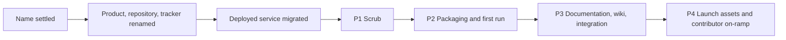
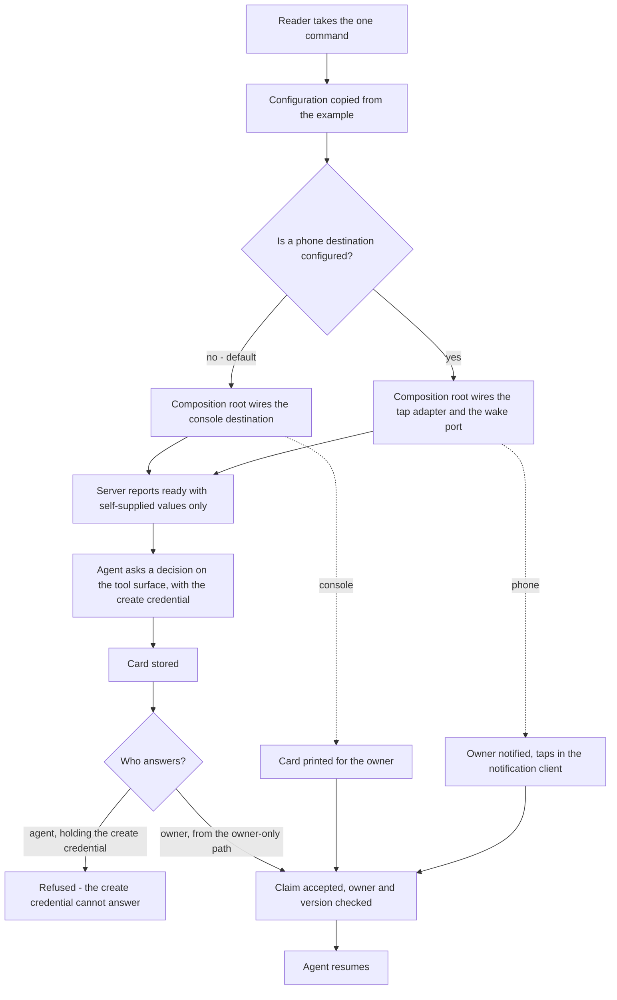

# paraphe OSS Public Readiness - Plan

## Goal Capsule

- **Objective:** A stranger with only Python installed installs paraphe, runs it, answers one decision without any of the author's infrastructure, and understands the project from the repository alone — with the repository still private.
- **Means:** The product and its deployed service are renamed first, then four sequenced pull requests — scrub, packaging and first run, documentation rewrite, launch assets (Key Decisions: sequenced pull requests; renamed before the flip).
- **Product authority:** the repository owner.
- **Open blockers:** none. The launch target and the product name are both settled.
- **Execution profile:** code.
- **Stop conditions:** Stop if the test suite is not green, if the private-term scan returns a match, if the resolved data location would create a second store rather than refuse, if the deployed service is left unable to start, or if a step would rewrite the shared history or push to a remote without the owner's sanction.
- **Tail ownership:** the repository owner. The visibility flip and any posting remain owner decisions outside this plan.

---

## Product Contract

### Summary

This plan renames the product and the service it runs as, then makes the repository installable, runnable, and legible to a stranger in four sequenced pull requests that each carry one failure mode. It grows the packaging workstream, because the first-run promise cannot hold while the shipped code cannot deliver a decision — and it holds the line that makes the product what it is, that the credential an agent holds never answers a decision.

**Product Contract preservation:** changed — R31–R39 added (first-run accessibility, distribution namespace, declared version floor, the answer-authority invariant, fail-closed relocation, the console destination, the container surface, and the single-name rule); the history Key Decision's rationale corrected; one success criterion added for the owner's launch target, two qualified as post-flip; Key Decisions added for the answer-authority invariant, the launch target, and the rename. The first-run, answer-authority, name-collision, container, console-destination and migration decisions were all put to the owner and answered; the remaining corrections came from the plan's own review pass before any code was written.

### Problem Frame

The implementation is real and it runs in production. Sixty-five tests pass, the code imports nothing outside the standard library, and a private deployment serves live traffic today. A zero-dependency core is a genuine asset: an install pulls no dependency tree, and a contributor can read the whole thing.

What is missing is everything that stands between a working tool and a stranger's first five minutes, and three gaps are wider than the original framing assumed.

Nothing installs it. There is no packaging metadata, no license file, and no command a reader can run.

Nothing explains it. The documentation was written as an internal record, so it refers to the author's host, the author's issue tracker, and the closed third-party product the tool surface was inherited from. One tracked file is not documentation at all but a build artifact of the author's review process, and it carries a link to a private pull request, commit identifiers, and a failing review verdict.

Nothing invites anyone. There is no contribution path, no continuous integration, no way to report a problem privately, and no repository wiki.

Two gaps only became visible when the first-run path was traced end to end:

- The repository ships the tap adapter's logic with its transport injected by the caller, and nothing in the repository constructs it. The production deployment supplies the transport and the credentials from outside. So a clone answers its own interface and hands a card to nobody, without an error.
- The configuration minimum cannot be met without obtaining a bot account from a third party first, which makes the documented first run unreachable for the reader the work targets.

The third gap is not in the code. The name is taken: an established project of the same name exists in the same category, describing itself as the inbox where agents meet humans, with a documentation site and a package registry presence. A reader arriving from search lands on that project, not this one. The author's own success criterion is that a reader arriving from search lands on the right project, and that criterion is unachievable under the current name. Renaming with zero users is cheap; renaming after a launch is not.

The cost is that a reader arriving today cannot evaluate the work without the author in the room.

### Key Decisions

- **The product is renamed before the flip.** The name in use is taken by an established project in the same category, which defeats the search-arrival criterion outright. Renaming while private and unlaunched is the only cheap moment. Governs R39.
- **The rename is total: product, repository, tracker, and the deployed service.** A repository renamed while its service keeps the old name leaves two names for one thing, and every operational document would have to state which is which. Governs R39.
- **The create credential creates; it never answers.** The credential an agent holds can raise a decision and read its outcome. Answering requires an identity the agent does not carry, and the transport that carries it is owner-only. This is the product's defining line: an inbox an agent can approve on its owner's behalf is not an owner-decision inbox. Governs R32, R35.
- **Sequenced pull requests over one launch diff.** Each workstream carries one failure mode, so a scrub miss is visible in a diff that contains nothing else. The rename and the service migration precede the sequence because every later artifact carries the name; they are separate from each other because a text rename and a production migration fail in different ways.
- **AGPL-3.0-or-later over a permissive license.** Self-hosting stays unrestricted, while offering paraphe as a network service carries the source obligation. Governs R7, R15. (session-settled: user-directed — chosen over MIT: coherent for a self-hosted tool, accepting a possible loss of corporate contribution.)
- **The working tree is scrubbed; the author's history is not rewritten.** Rewriting is destructive on a shared remote. The exposure the history carries is real and is not a display problem: the personal address sits in commit objects and stays readable in every clone, and the commit subjects name a private tracker and a private branch. A `.mailmap` addresses attribution only and was never a privacy control. Publishing from a fresh single-commit public history resolves the exposure without touching the shared repository. Governs R1.
- **`implementation-notes.html` is deleted rather than sanitized.** It is a build artifact of a private review process, not documentation. Sanitizing it would preserve the wrong thing in the wrong place. Governs R2.
- **One canonical AGENTS.md per level, with CLAUDE.md as a pointer.** Duplicated prose drifts; a pointer cannot. Governs R17, R18.
- **The public tracker is the repository's own issues, reusing the existing triage label names.** The labels are already the vocabulary contributors will list against; changing them buys nothing. Governs R19, R23.
- **paraphe publishes its own tool surface rather than crediting the product it was inherited from.** The tool names are load-bearing, so the repository owns them and explains them on its own terms, and the local teardown of the other product is deleted. Governs R11. (session-settled: user-approved — chosen over crediting the source product as a compatibility baseline: a repository cannot explain why its interface looks the way it does by citing a product it does not control.)
- **Extend the seams that already exist rather than introduce new ones.** The wake path already exposes a two-method adapter contract, and the example configuration already maps the configuration surface. Governs R3, R9, R10.
- **A relocated data location fails closed.** A store that cannot be found where the configuration says it should be is an error, not an empty inbox. Governs R36.
- **A container image ships.** The launch target depends on reach, and container-first is how the self-hosting audience evaluates a tool. A zero-dependency standard-library application makes this one file and one job, not a second surface to maintain in parallel. Governs R38. (session-settled: user-directed — reversed an earlier deferral.)
- **The launch target is quantitative.** The owner set a thousand stars within ninety days of launch rather than leaving the criteria qualitative. Governs R29, R30. (session-settled: user-directed.)

### Requirements

**Identity**

- R39. One name is used everywhere: the product, the repository, the distribution, the command, the configuration prefix, the tracker project, and the deployed service all carry the current name, and no tracked file carries the previous one. The deployed service's unit name, account name, data location, and credential names are not tracked.

**Private context out**

- R1. No tracked file contains a personal or private reference: no self-hosted infrastructure or machine name, no absolute local filesystem path, no private issue-tracker identifier, no personal name or email address, and no name of the closed third-party product whose tool surface paraphe inherits. A tracked filename that carries one of those counts as a file containing it. The term list the scan enforces is itself not tracked.
- R2. `implementation-notes.html` is removed from the repository.
- R3. Filesystem locations, network ports, and credential values resolve from configuration or a platform default, and no hard-coded absolute path remains in executable code. A data directory paraphe creates is private to its owner.

**Packaging and first run**

- R4. A person with only Python installed obtains a working paraphe with one documented command, and installs no third-party dependency to do so.
- R5. The command the README gives a reader is the command verified on a clean checkout using only the README.
- R6. paraphe ships an installed CLI entrypoint, not a module path a reader has to know.
- R7. The repository carries an AGPL-3.0 LICENSE file.
- R8. A new operator reaches a running instance by copying the example configuration and filling in a documented minimum of values.

**Runtime neutrality**

- R9. The owner-tap wake path reaches its destination through a runtime-agnostic interface, with the behavior specific to the runtime paraphe was built against retained as one adapter behind that interface.
- R10. The adapter contract is documented well enough that a contributor adds a destination without reading the wake implementation.
- R11. paraphe's tool surface is published as paraphe's own contract: a documented list of tool names and fields that does not depend on the product the surface was inherited from.

**README and launch narrative**

- R12. The README's first screen states what paraphe is, who it is for, and the one command that runs it.
- R13. The README demonstrates the core loop — the agent asks, the owner answers, the agent resumes — in a form a reader can evaluate without installing anything.
- R14. A recorded demo asset shows the same loop end to end against a phone destination.
- R15. The README states the license obligation in plain language and does not read as hostile to companies.
- R16. A public roadmap names what is next and what is deliberately not planned.

**Agent instruction files**

- R17. Every directory level that carries its own instructions has exactly one canonical AGENTS.md, and a nested level states only what differs locally.
- R18. Every CLAUDE.md is a single line pointing at its level's AGENTS.md.
- R19. Contributor-facing tracker documentation names the public tracker, its labels, and its workflow instead of a private one.

**Repository wiki**

- R20. The repository carries an initialized OpenWiki describing its architecture and modules as they stand after the scrub.
- R21. The wiki is regenerable from the code without manual rework.

**Contributor on-ramp**

- R22. CONTRIBUTING.md states how to run the suite locally and what a mergeable change looks like.
- R23. The repository provides issue and pull-request templates, and the triage labels exist on the public tracker.
- R24. The repository carries a code of conduct.
- R25. At least one open issue is scoped and labelled for a first-time contributor.

**Trust signals**

- R26. Continuous integration runs the test suite on every push and pull request, on more than one Python version and on at least one operating system other than the author's.
- R27. SECURITY.md names a private channel for reporting a vulnerability and the response to expect.
- R28. Status badges in the README reflect that running integration rather than a static image.

**Launch assets**

- R29. A launch post draft exists for the primary launch channel.
- R30. Repository metadata is prepared: description, topics, and a social preview image.

**First run without the author's environment**

- R31. The server starts and reports ready without any credential the reader must obtain from a third party; the documented minimum configuration names only values the reader supplies themselves.
- R32. One decision can be asked and answered on a fresh local instance without a phone, through an owner-side answer path that the agent's credential cannot reach, so the core loop is exercisable end to end before any tap destination is configured.
- R33. The distribution installs exactly one top-level import package, and it is not a name that collides with another project's.
- R34. The repository declares its minimum Python version and enforces it at install, so an unsupported interpreter fails at install rather than at first import.
- R35. The credential an agent holds is insufficient to answer a decision. An answer is accepted only from an identity the agent does not carry, and no tool on the agent's surface answers or claims a card.
- R36. A change of data location never silently starts a second, empty store. When the resolved location holds no store and one exists at the location the previous version used, startup refuses and names both locations; it never creates.
- R37. The first run exercises the whole loop with no external service: the reader sees the card, answers it, and the agent resumes.
- R38. A container image is published from the repository, and continuous integration builds it, so the audience that evaluates a self-hosted tool by its container can run it without reading the packaging.

### Key Flows

- F1. First run by a stranger
  - **Trigger:** A reader with no prior knowledge opens the repository.
  - **Actors:** the reader, who becomes an operator.
  - **Steps:** Read the first screen and learn what paraphe is. Take the one command. Copy the example configuration and fill in the documented minimum. Reach a running instance. Cause one decision to be asked, see it arrive, answer it from the owner-side path, and watch the agent resume.
  - **Outcome:** A running paraphe, and the whole loop exercised once without a third-party credential and without an external service, with the answer arriving from the owner rather than from the agent that raised the card.
  - **Covers:** R4, R5, R8, R12, R13, R31, R32, R35, R37

- F2. First contribution
  - **Trigger:** A user wants to change something.
  - **Actors:** the contributor.
  - **Steps:** Reach CONTRIBUTING from the README. Run the suite locally. Take a scoped first-time issue. Open a pull request and watch integration run on it.
  - **Outcome:** A merged change from someone who is not the author. This outcome cannot occur while the repository is private; until the flip the flow is exercised by an invited collaborator, and the outcome is realized after it.
  - **Covers:** R22, R23, R25, R26

### Acceptance Examples

- AE1. **Covers R1, R3.** Given the categories named in R1, when a content-and-filename scan runs over every tracked file and an absolute-path scan runs over executable code, then both return zero matches and the scan's own term list is not among the tracked files.
- AE2. **Covers R5, R37.** Given a clean checkout and nothing but the README and the example configuration, when a reader follows the documented steps without access to the author's environment, then they reach a running instance, cause one decision to be asked, see it arrive, answer it, and observe the agent resume — with no external service in the path.
- AE3. **Covers R9.** Given a wake destination that is not the runtime paraphe was built against, when the owner answers a decision, then the tap still reaches the owner and the agent still resumes.
- AE4. **Covers R3.** Given a data directory configured to a location other than the default, when paraphe runs, then no file is read or written outside that location, and the directory paraphe creates is not readable by other accounts.
- AE5. **Covers R36.** Given a store holding a card at one location, when the server starts with the default resolving to a different location, then it refuses with one line naming both locations and no card is lost or stranded.
- AE6. **Covers R35.** Given a caller holding the credential an agent holds, when it attempts to answer a decision, then the attempt is refused, no claim is recorded, and the card is unchanged.
- AE7. **Covers R39.** Given the repository, the tracker, the distribution and the deployed service, when each is inspected for the product name, then all carry the current name and none carries the previous one in a tracked file.

### Success Criteria

- SC1. A reader who has never seen the project can state what paraphe does after the first screen of the README.
- SC2. A person with only Python installed goes from the README to a running instance without asking the author anything. Realizable only after the visibility flip; until then it is exercised by the author in a clean environment or an invited collaborator.
- SC3. Someone who is not the author has a merged change. Realizable only after the visibility flip; until then the flow is exercised by an invited collaborator.
- SC4. A reader who runs the first run, or watches the demo asset, can describe the loop without watching it twice.
- SC5. A reader arriving from search lands on the right project, because the name is not shared with another project in the category and the description, topics, and wiki agree with the README. The in-scope half — a name no other project in the category holds, and metadata prepared to agree with the README — is verifiable at completion; the arrival itself is realizable only after the visibility flip.
- SC6. The project reaches a thousand stars within ninety days of its launch. This is a distribution outcome that this work enables and does not produce: the pull requests yield no stars on their own, and the campaign that pursues the number is separate and owner-run.

### Scope Boundaries

**Deferred for later**

- Rewriting the author's commit history to remove the personal address and the private references in commit subjects. The private repository keeps its history intact and the public repository begins from a fresh single-commit history, created under a project identity.
- A shipped tap transport for a phone destination. The production deployment supplies one from outside the repository; R31, R32 and R37 remove the need for it on a stranger's first run.
- Applying repository metadata. Drafts only while private; topic names are public even on a private repository, so applying them before the flip leaks them.
- Per-file license headers. The repository-level license file and the declared license expression are sufficient and machine-readable.
- Windows support and a Windows integration job. The suite binds a loopback address, relies on file modes, and assumes a data location that does not exist on Windows; the platform needs portability work before it can be added honestly.

**Outside this product's identity**

- paraphe does not become a general workflow engine, a task tracker, or a chat client. It is an owner-decision inbox.
- paraphe does not let an agent answer the decision it raised, on any surface, at any configuration.
- paraphe does not compete on the number of destinations it can notify.
- The repository does not carry the author's personal infrastructure documentation.

**Not in this work**

- The visibility flip. The repository stays private until a separate owner decision.
- Publishing anything to a package index. R29 covers drafts only; posting is a separate owner decision.

**Deferred to Follow-Up Work**

- Coverage gates and static type checking. Neither is earned at this version.
- An upgrade path that moves an existing store automatically. This plan refuses instead, which is the smaller and safer diff; a move can be added once someone actually needs it.

### Dependencies / Assumptions

- The repository stays private for the whole of this work.
- AGPL-3.0-or-later is final, and the declared license expression matches the license file and the README.
- Python is the only runtime a stranger needs, and the standard-library-only property is maintained, so an install pulls no dependency tree. The install itself still reaches the network once, to fetch the build backend.
- The existing test suite stays green throughout, because it is the only proof that the scrub and the namespace change altered no behavior. The wake-port unification is the one deliberate exception, and it is proved separately rather than by that green suite.
- **The deployed service is deliberately migrated, not left alone.** It runs under the previous name from a fixed source tree and a fixed data directory, and it receives its credentials from the platform's encrypted store. The migration renames the unit, the account, the data directory and the credential names, and moves the store. Every one of those values lives in the private tracker issue and in the migration runbook, never in this repository.
- The migration is the only step in this plan that can take the deployed service down. It is sequenced first, it is reversible, and its rollback is the previous unit and the previous data directory left in place until the new one is verified.

### Outstanding Questions

**Blocking**

- None.

**Deferred**

- Which non-Linux system integration covers. The plan assumes one non-Linux job becomes viable once the default data location stops assuming a system-wide path; if that job turns red for environmental reasons, the honest fallback is to pin the matrix to Linux and record the requirement as unmet rather than to ship a job that a first-time contributor reads as their own breakage.
- Whether the repository should eventually ship its own tap transport, rather than depending on one supplied from outside. Deferred to follow-up work; R31, R32 and R37 mean the first-run promise does not depend on it.
- Whether the internal planning and research documents stay in the public repository. This plan scrubs and keeps them; removing them is a smaller diff if the owner prefers a repository that carries only product documentation.
- Which non-default registry, if any, the container image is published to. A local build satisfies R38; publishing is a separate owner decision alongside the flip.

### Sources / Research

- `README.md` — the first screen R12 rewrites, and the surface three units touch. It is stale in two directions at once: it presents the project as pre-runtime while a live deployment serves traffic, and it names a private tracker, a private issue, and the author on its first screen.
- `CONTEXT.md` and `docs/agents/` — the glossary and the tracker, label, and domain documentation R19 rewrites. The triage label file is already free of private terms and is kept; the tracker file is entirely private-tracker instructions and is rewritten.
- `docs/adr/` — ten records. ADR 0010 carries the create/tap separation that R35 makes explicit, and it is the authority the answer path is built against; the records covering the store and the cutover constrain the data-location work; the wake record is the one to amend when the null port is unified.
- The wake path and the tap adapter — one exposes the two-method contract a contributor writes against, the other holds the tap logic with its transport injected. Together they show that runtime neutrality is a documentation problem, not a redesign. The wake path also holds two null implementations that disagree, which is the defect U5 fixes deliberately.
- The tool guide string the operator's agent reads first still describes paraphe as compatible with the inherited product. R11 governs; the existing test asserts only that the guide names a tool, so the rewrite is test-safe, and the removal of the inherited name belongs to the scrub while the rewording belongs to the unit that owns the tool surface.
- `src/inbox/http.py` — the credential check and the exception reflection that any new answer path and any new error line must respect.
- `config.example.toml` — the configuration surface R3 and R8 build on. It carries placeholders only, and it has no data-location key, which is why AE4 is unsatisfiable until one exists. The deployed service already sets a variable under the current prefix, which fixes the key's name.
- The specification document and its user stories — the source of the core loop R13 must demonstrate. It is renamed with the product, so this plan refers to it by role rather than by its current filename.
- `implementation-notes.html` — to be deleted under R2.
- `tests/` — the suite that proves the scrub and the rename changed no behavior. Three tests carry the blast radius: one pins the hard-coded data location; one pins the exact normalized thread shapes the wake contract returns; and one reaches into the loaded module table by name, so the namespace change reaches it.
- External: current packaging conventions (the declared license expression supersedes license classifiers; the license file's contents drive host-side detection), the supported Python releases, the practice of building generated documentation into the repository rather than the host's separate wiki, and the registry checks that settled the name.

---

## Planning Contract

### Key Technical Decisions

- KTD1. **The scrub diff carries nothing but the scrub.** The data-location and port work for R3 lands in the packaging and first-run pull request instead, because its proof is a first-run acceptance example and mixing it into the scrub diff would hide a scrub miss behind an unrelated change. Rejected: keeping all of R3 in the first pull request, which is where the requirements group it. Cites Key Decisions: sequenced pull requests.
- KTD2. **One import package for the distribution, and it carries the product name.** The single top-level package is named for the product, so the distribution, the import name and the command agree. Rejected: keeping three top-level packages, one of which shadows another project's module and neither of the others is distinctive; and folding the adapter and protocol packages into the core, which fixes the shadowing but leaves a generic top-level name that a public repository cannot defend. Cites R33, R39. (session-settled: user-directed — chosen over folding the adapter and protocol packages into the core, or shipping three top-level names.)
- KTD3. **The default data location is user-scoped, with the platform's convention deciding it, and the location key keeps the name the deployed service already sets.** Configuration and environment override the default, resolved in one function that the validator, the composition root, and the tests all call, so the path that is checked is the path that is opened. Rejected: changing the existing system-wide default to another fixed path, which keeps AE4's unavailability and makes a non-Linux job impossible; resolving the location at each call site, which lets the checked path and the opened path differ; and naming the key something new, which would silently strand the deployed store behind the fail-closed rule. Cites R3, R36, AE4.
- KTD4. **The answer path is owner-only and carries its own credential.** The answer credential is distinct from the create credential; the create credential is refused on the answer path; the answer routes through the existing claim path, never through the recording shortcut, so the owner and version checks stay intact; the path records how the answer actually arrived rather than reporting every answer as one that came from a phone. The answer path refuses to start on a non-loopback bind rather than warning, and the configuration file is kept out of version control. Rejected: guarding the answer with the create credential, which lets an agent answer its own card and inverts the product; warning instead of refusing on a non-loopback bind, which leaves the owner's answer endpoint reachable by every peer on the private network while a warning-only implementation still passes review; and treating a loopback bind as the control, which it is not, since every local process can reach it. Cites R32, R35, AE6, Key Decisions: the create credential creates and never answers.
- KTD5. **The private-term scan runs in continuous integration, and locally at every pull-request boundary until that job exists.** A one-time scan is a claim about the day it ran. The scan script is created with the scrub, and running it locally before each pull request closes the window between the scrub and the integration job. Rejected: a manual scan recorded in the pull request description; and moving the integration job into the scrub pull request, which would put a workflow file in the diff that is defined as carrying nothing but the scrub. Cites R1, AE1.
- KTD6. **The author's history is not rewritten; the public repository begins from a fresh single-commit history, created under a project identity.** Rejected: rewriting the shared history, which is destructive across every existing worktree; accepting the exposure, which publishes a personal address and private tracker references permanently; and creating the fresh history under the author's existing identity, which would republish the address the fresh history exists to drop. Cites R1. (session-settled: user-directed — chosen over rewriting the shared history or accepting the exposure.)
- KTD7. **The scan's term list is not a tracked file.** The script is committed and takes the list from outside the repository; it reports the file and the category and never the matched value, and for a filename match it reports a masked basename, because for that category the path is the matched value. Rejected: committing the terms, which would make the repository violate the rule the scan enforces and would publish them in public build logs. Cites R1, AE1.
- KTD8. **Unifying the two null wake ports is a deliberate behavior change, not part of the rename's no-change claim.** A test pins the intended behavior before the change lands. Rejected: adopting one implementation silently while the suite is asserted to prove nothing changed; and altering the wake contract's normalized thread shapes. Cites R9, R10.
- KTD9. **The rename is one mechanical change across product, repository, distribution, command, configuration prefix and tracker, and it lands before anything else is written.** Every later artifact carries the name, so renaming after them means writing them twice. Rejected: renaming the product while the repository and tracker keep the old name, which leaves two names for one thing in every document. Cites R39.
- KTD10. **The migration is reversible and it moves data by copy, not by cut.** The new unit starts against a copied store while the old unit and its data directory stay in place; the old name is retired only after the new service has served a real decision. Rejected: renaming the account and path in place, which cannot be rolled back once the old unit stops resolving; and leaving the service on the old name, which the owner rejected. Cites R39.
- KTD11. **The first run exercises the whole loop with no external service.** A console destination prints the card, takes the answer, and resumes the agent, using the same destination contract a contributor writes against. Rejected: shipping the phone transport, which adds an outbound client and a polling loop to satisfy a first run; and leaving the loop to a recorded asset, which asks the reader to trust a video for the product's defining behaviour. Cites R37, R32, AE3.
- KTD12. **The container is one file and one job.** A minimal image built from the repository with the declared Python floor, built and smoke-tested in integration. Rejected: a compose file and a published multi-arch pipeline, which the reach requirement does not need yet. Cites R38.

### High-Level Technical Design

The sequencing is the design. Two operations change what is true outside the repository, and both happen before anything public-facing is written.

The first-run path is the plan's central change, because that is where the promise and the shipped code diverged. The two paths are not two flavours of one thing: they differ in answer authority as well as in transport.

### System-Wide Impact

| Surface | Change | Failure if missed |
|---|---|---|
| Product identity | Name changes across product, repository, tracker, distribution, command and configuration prefix | Two names for one thing; every document must say which is which |
| Deployed service | Unit, account, data directory and credential names change; the store moves | The live service stops resolving its data or its credentials |
| Agent tool surface | The create credential gains no new powers; no tool answers or claims a card | An agent answers its own decision and the product's defining line is gone |
| Owner answer path | New, owner-only, separate credential, routed through the claim path | Credential possession degenerates into answer authority |
| Server composition root | Assembles settings, store, answer destination, and transport in one place | The checked path and the opened path diverge; a clone starts with nothing wired |
| Persistent store | Default location moves; location resolution becomes one function | A relocation silently creates an empty store and strands every existing card |
| Configuration parser | Phone-destination settings become conditional; the owner-identity check does not; the prefix changes | An owner identity that never resolves becomes acceptable, and every claim check weakens with it |
| Error and ready output | New human-facing lines replace tracebacks | A credential or a configuration value is echoed to whoever holds the credential |
| Continuous integration | New jobs for the suite, the distribution, the private-term scan, and the container | The scrub regresses silently and no contributor sees it |
| Generated documentation | A generated wiki is committed and regenerated after the name settles | Pages describe paths and names that later move |

Human-only boundary: answering a decision is never agent-accessible. Action parity is deliberately asymmetric — the agent keeps create and read, and never gains answer.

### Assumptions

- The reader's Python is a supported release; R34 makes an unsupported one fail at install rather than at first import.
- The reader can supply the create credential and the answer credential themselves, so the local answer path needs no third party — but the two are different values, and the answer credential is never handed to an agent.
- The migration's exact values — unit, account, data directory, credential names — are held in the private tracker issue and the migration runbook, not in this repository.

### Sequencing

| Position | Workstream | Units | Why this position |
|---|---|---|---|
| 0 | Product rename | U12 | Every later artifact carries the name. |
| 1 | Service migration | U13 | The deployed service must run under the current name before the packaging change alters its module path. |
| 2 | Scrub | U1 | Nothing else may precede it; every later diff is scanned for private terms. |
| 3 | Packaging and first run | U2, U3, U4, U5 | Everything that changes code or packaging, so the documentation rewrite describes a settled shape. |
| 4 | Documentation, wiki, integration | U6, U7, U9 | Describes the post-scrub, post-rename repository, so no page documents a path that later moves. |
| 5 | Launch assets | U8, U10, U11 | Adds the trust signals, the container, and the drafts last, after the repository is worth looking at. |

---

## Implementation Units

Paths are given for the layout the unit runs against. U1, U2 and U12 run before or against the current layout; U3 performs the move; U4 onwards use the post-move paths. Unit identifiers were assigned before this revision and execution order is the sequencing table above, not identifier order.

| Unit | Title | Primary paths | Depends on |
|---|---|---|---|
| U12 | Rename the product, repository, tracker and distribution | `README.md`, `CONTEXT.md`, `docs/`, repository settings, tracker project | — |
| U13 | Migrate the deployed service to the current name | private runbook and tracker issue; no tracked path | U12 |
| U1 | Scrub private context from the working tree | `README.md`, `CONTEXT.md`, `AGENTS.md`, `docs/`, `src/`, `tests/`, `tools/` | U13 |
| U2 | Make the data location configurable, user-scoped, and fail-closed | `src/inbox/store.py`, `src/inbox/config.py`, `config.example.toml`, `tests/inbox/test_setup.py` | U1 |
| U3 | One installable distribution with a command and a licence | `pyproject.toml`, `LICENSE`, `src/paraphe/` | U2 |
| U4 | First run that needs no third-party credential | `src/paraphe/__main__.py`, `src/paraphe/inbox/`, `config.example.toml` | U3 |
| U5 | Runtime neutrality and the published tool surface | `src/paraphe/adapters/`, `src/paraphe/inbox/`, `docs/adapters.md`, `docs/tools.md` | U3 |
| U6 | Documentation rewrite | `README.md`, `CONTEXT.md`, `AGENTS.md`, `CLAUDE.md`, `docs/agents/`, `docs/demo/` | U5 |
| U7 | Generated repository wiki | `openwiki/`, `AGENTS.md` | U1, U3 |
| U8 | Contributor on-ramp and trust signals | `CONTRIBUTING.md`, `SECURITY.md`, `CODE_OF_CONDUCT.md`, `.github/` | U6 |
| U9 | Integration, version floor, and the standing private-term gate | `.github/workflows/ci.yml`, `README.md`, `pyproject.toml` | U8 |
| U10 | Launch assets and metadata drafts | `docs/launch/`, repository settings draft | U9 |
| U11 | Container image and its integration leg | `Dockerfile`, `.dockerignore`, `.github/workflows/ci.yml` | U9 |

Surface ownership, so a file edited by more than one unit has one owner and the others are scoped to their own reason.

| Surface | Owner | Other units |
|---|---|---|
| `README.md` | U6 (the rewrite) | U12 renames only; U1 removes private terms only; U9 adds the badge line only |
| `AGENTS.md` | U6 (the one-file-per-level structure) | U1 removes private terms only; U7 writes the generator's managed block only |
| `docs/agents/issue-tracker.md` | U6 (the rewrite) | U1 removes private identifiers only |
| `config.example.toml` | U2 (the keys) | U12 renames the prefix only; U4 documents the local minimum |
| `CONTEXT.md` | U6 (the rewrite) | U1 removes private terms only |
| `src/inbox/config.py` | U2 (the resolution function and the keys) | U1 removes private identifiers only |
| `src/inbox/store.py` | U2 (the location resolution) | U1 removes private identifiers only |
| `src/paraphe/inbox/__init__.py` | U4 (the composition root and the answer path) | U1 removes private terms only; U3 rewrites its imports only; U5 rewrites the tool surface only |
| `tests/inbox/test_setup.py` | U4 (the first-run contract) | U1 removes private identifiers only; U2 adds the resolution and refusal cases; U3 updates the loader only |
| `tests/inbox/test_mcp_lifecycle.py` | U5 (the tool surface and wake behavior) | U1 removes private identifiers only; U3 updates the loader and the loaded module name only |
| `pyproject.toml` | U3 (the metadata and the entry point) | U9 adds the version floor and continuous-integration-facing metadata only |
| `.github/workflows/ci.yml` | U9 (the suite, distribution and scan jobs) | U11 adds the container job only |
| `docs/adr/*.md` | U1 (the scrub rewrites them) | U5 amends the wake record only |

### U12. Rename the product, repository, tracker and distribution

- **Goal:** One name is used everywhere a reader can see, and the previous name survives nowhere they can see it.
- **Requirements:** R39
- **Dependencies:** none
- **Files:** `README.md`, `CONTEXT.md`, `docs/**`, `src/**`, `tests/**`, `pyproject.toml`, repository settings, tracker project
- **Approach:**
  1. Rename the repository, and update the remote in every worktree that points at it.
  2. Rename the tracker project, and rename this plan file and its topic.
  3. Rename the distribution, the import package, the console command, and the configuration prefix together, so a reader never meets two of them with different names.
  4. Sweep the tracked tree for the previous name and rename every occurrence, including the specification document's filename.
  5. Record the previous name only where a migration needs the correspondence, and never in a tracked file.
- **Patterns to follow:** the repository's existing documentation layout, unchanged apart from the name.
- **Test scenarios:**
  - Given the tracked tree, when it is scanned for the previous product name, then it returns zero matches.
  - Given a fresh clone and an install, when the command is run, then it is the current name and it resolves.
  - Given the tracker project, when it is read, then it carries the current name.
- **Verification:** the previous name is absent from the tracked tree; the repository, the tracker project, the distribution and the command all carry the current name; the suite is green after the module rename, with the loader updates in U3.

### U13. Migrate the deployed service to the current name

- **Goal:** The deployed service runs under the current name, against a moved store, with its credential and unit names renamed, and the previous name retired only after the new service has served a real decision.
- **Requirements:** R39, R36
- **Dependencies:** U12
- **Files:** the private tracker issue and the migration runbook. No tracked file carries the unit name, the account name, the data directory, or the credential names.
- **Approach:**
  1. Write the runbook first, naming every literal value: the unit, the account, the data directory, the credential names, the configuration prefix, and the stop and start commands.
  2. Stop the old unit, create the new account and the moved data directory with the same restrictive ownership, and copy the store.
  3. Install the new unit against the copied store, with the renamed credential references and the renamed configuration prefix, and start it.
  4. Cause one real decision to be asked and answered against the new service.
  5. Retire the old unit only after that decision has completed. Leave the old data directory in place until the new one has served traffic.
- **Execution note:** This is the only unit that can take production down. Rehearse the runbook's stop, copy and start steps against a scratch account before touching the live service.
- **Patterns to follow:** the existing unit's hardening — a dedicated account, a read-only source tree, encrypted credentials, and a write path limited to the data directory.
- **Test scenarios:**
  - Given the old unit and its store, when the new unit starts against the copied store, then every existing card is present and the service accepts a decision.
  - Given the migration runbook, when it is executed on a scratch account, then the stop, copy and start steps complete without touching the live service.
  - Given the new service has served one decision, when the old unit is stopped, then nothing resolves to the old name.
  - Given a rollback before the old unit is retired, when the old unit is started again, then it serves from its untouched data directory.
- **Verification:** the new service serves a real decision; the store contains the pre-migration cards; the previous name resolves for nothing; the old directory is intact until the owner confirms the cutover.

### U1. Scrub private context from the working tree

- **Goal:** Every tracked file and tracked filename is free of the private categories R1 names, the build artifact of the private review process is gone, and the scan that keeps it that way exists.
- **Requirements:** R1, R2
- **Dependencies:** U13
- **Files:** `README.md`, `CONTEXT.md`, `AGENTS.md`, `docs/agents/issue-tracker.md`, `docs/adr/*.md`, `docs/specs/*.md`, `docs/plans/*.md`, `docs/research/*.md`, `src/inbox/config.py`, `src/inbox/store.py`, `src/inbox/__init__.py`, `src/adapters/wake.py`, `src/adapters/telegram.py`, `tests/inbox/test_*.py`, `tools/scan_private_terms.py`, `implementation-notes.html` (deleted)
- **Approach:** One category per hunk, so a reviewer reads a scrub rather than a rewrite.
  1. Delete the build artifact of the private review process; nothing links to it, and the wiki is generated afterwards from the scrubbed tree.
  2. Remove the private tracker identifiers from module docstrings, test docstrings, and the documents that carry them. The tracker rewrite itself belongs to U6; this unit only removes what R1 forbids.
  3. Rename the tracked files whose names carry a term R1 names — the scan in this unit lists them — and re-point every reference to them.
  4. Remove the inherited product's name from the shipped tool guide, leaving the surrounding compatibility wording to U5, which owns the tool surface. Delete the local teardown of the other product and re-point anything that cites it.
  5. Rewrite the internal documents that name the author's machine, host, or tracker. Keep them: they are product documentation once scrubbed.
  6. Add the standard-library scan script, which takes the term list from outside the repository, reports the file and the category, masks the basename for a filename match, and never prints a matched value.
- **Patterns to follow:** the existing module docstring convention; the existing decision records' shape when rewriting the ones that carry private terms; the repository's standard-library-only rule for the script.
- **Test scenarios:**
  - Given a tracked file containing a term from the list, when the scan runs, then it fails and names the file and the category, and prints no matched value.
  - Given a tracked filename containing a term, when the scan runs, then it reports the masked basename and the category, and prints no matched value.
  - Given a clean tracked tree, when the scan runs, then it passes.
  - Given the scan's own term list, when the scan runs, then it reports the list as untracked.
  - Test expectation: none beyond the above — the scrub itself has no behavioral change. The scan and the green suite are its proof.
- **Verification:** the scan returns zero over tracked files and filenames; the absolute-path scan over executable code returns zero; the suite is green; the deleted file is absent from the index and nothing references it.

### U2. Make the data location configurable, user-scoped, and fail-closed

- **Goal:** One function resolves the data location from configuration, environment, or a platform default; an unusable location fails at startup with one plain line; and a location change refuses rather than starting an empty store.
- **Requirements:** R3, R8, R36, AE4, AE5
- **Dependencies:** U1
- **Files:** `src/inbox/store.py`, `src/inbox/config.py`, `src/inbox/__init__.py`, `config.example.toml`, `tests/inbox/test_setup.py`
- **Approach:**
  1. Add one resolution function, used by the validator, the composition root, and the tests, so the path that is checked is the path that is opened.
  2. Default to the platform's per-user location; add the configuration key and its environment counterpart under the current prefix, with the environment winning, matching the existing resolution order and keeping the name the deployed service already sets.
  3. Retain the location the previous version used as a named constant that the refusal check and its test both read, so the refusal can actually fire.
  4. Create the data directory with owner-only permissions and check it; keep the store file's existing restrictive mode; map permission failures to the existing setup error so they arrive as one line rather than a traceback.
  5. Refuse to start when the resolved location holds no store while the retained location does, naming both, and never create in that case.
  6. Update the test that pins the old fixed path to assert the resolved default, and add the refusal, directory-mode, and persistence coverage.
- **Patterns to follow:** the existing key-plus-environment resolution; the existing fail-closed setup error convention.
- **Test scenarios:**
  - Covers AE4. Given a configured data location, when the server runs, then the store and its file are created under that location and nothing is written outside it.
  - Covers AE4. Given a data location paraphe creates, when it is created, then the directory is not readable or traversable by other accounts and the file keeps its restrictive mode.
  - Covers AE5. Given a store holding a card at one location, when the server starts with the default resolving to another, then it raises the setup error naming both locations and creates nothing.
  - Given no data location configured, when settings load, then the resolved default is a per-user path, not a fixed system directory.
  - Given the environment value the deployed service sets, when settings load, then it is honoured under the current prefix.
  - Given a data location the process cannot write, when the server starts, then it raises the setup error with a single readable line and exits non-zero, rather than raising a permission error later.
  - Given a store holding a card, when the server restarts against the same location, then the card is still present.
- **Verification:** the suite is green; a run with a temporary data location writes only there; a relocation attempt refuses and names both paths.

### U3. One installable distribution with a command and a licence

- **Goal:** One command installs a single-top-level-package distribution named for the product, which exposes a runnable command, with declared metadata and the licence file.
- **Requirements:** R4, R6, R7, R33, R34
- **Dependencies:** U2
- **Files:** `pyproject.toml`, `LICENSE`, `src/paraphe/`, `src/inbox/`, `src/adapters/`, `src/mcp/__init__.py` (deleted), `tests/inbox/test_*.py`
- **Approach:**
  1. Move the three top-level packages under one package named for the product and update every intra-package import; delete the module that exists only as a docstring and is imported by nothing.
  2. Update the test loaders, which name the loaded module explicitly, to the new module paths.
  3. Declare the project metadata: name, version, description, readme, the declared minimum Python version, the license expression, the license file, an explicitly empty dependency list, and a console entry point.
  4. Add the licence file, and make the expression used in metadata, the file's notice, and the README agree.
- **Patterns to follow:** the existing src-layout package-per-concern organization, unchanged apart from the shared parent.
- **Test scenarios:**
  - Given the built distribution, when it is installed into a clean environment, then exactly one top-level import package is provided, it is the product's name, and the command is on the path.
  - Given an interpreter below the declared floor, when the distribution is installed, then installation fails rather than succeeding and failing at first import.
  - Given the suite, when it runs after the namespace move, then all tests pass and the loaded module names are the new ones.
- **Verification:** an install into a clean environment succeeds; the command runs; the suite is green; the built artifact lists one top-level package.

### U4. First run that needs no third-party credential

- **Goal:** A reader with nothing but Python starts the server with self-supplied values, sees it report ready, asks a decision, sees the card, answers it through an owner-only path, and the agent resumes.
- **Requirements:** R8, R12, R31, R32, R35, R37, AE2, AE3, AE6
- **Dependencies:** U3
- **Files:** `src/paraphe/__main__.py`, `src/paraphe/inbox/__init__.py`, `src/paraphe/inbox/config.py`, `src/paraphe/inbox/http.py`, `src/paraphe/adapters/console.py`, `config.example.toml`, `.gitignore`, `tests/inbox/test_setup.py`, `tests/inbox/test_tap_claims.py`
- **Approach:**
  1. Make the phone-destination settings required only when the phone path is configured, so the default configuration starts, and invert the test that asserts the opposite today. The owner-identity check stays unconditional: a configuration that names a phone destination without a valid owner identity still fails, and an identity never silently becomes zero.
  2. Add the owner-only answer path: a credential distinct from the create credential, refused on the create credential, routed through the claim path so the owner and version checks still apply, and never through the recording shortcut that bypasses them. State the identity contract — the answer credential is the owner identity — and record how the answer arrived rather than reporting every answer as one that came from a phone.
  3. Add the console destination behind the same contract a contributor implements: it renders the card where the owner is looking, takes the answer, and lets the agent resume. It carries no external service and no network call.
  4. Add the composition root the entry point needs: settings, store, answer path, and destination assembled in one place, with the destination chosen by configuration. Add no tool to the agent surface.
  5. Resolve the configuration file from a documented argument and a documented default, add that default filename to the version-control ignore rules, and assert it is untracked.
  6. Bind a documented local address and port by default; refuse to start when the answer path is enabled on a non-loopback bind. Print the address and the ready state on one line. Every new error and ready string is static: none interpolates a credential or a configuration value.
- **Execution note:** This is mostly wiring and configuration; prefer starting the server and exercising the whole loop over unit coverage alone.
- **Patterns to follow:** the existing credential check on the tool surface; the existing claim path with its owner and version checks and its refusal reasons; the existing port injection on the inbox constructor.
- **Test scenarios:**
  - Covers AE2. Given a clean checkout, the example configuration, and self-supplied values, when the reader follows the documented steps, then the server reports ready, no third-party credential was needed, and the loop completes without an external service.
  - Covers AE6. Given a caller holding the credential an agent holds, when it attempts to answer a decision, then the refusal reason is returned, no claim is recorded, and the card is unchanged.
  - Covers AE6. Given the create credential and the answer credential, when the configuration is validated, then they are required to differ.
  - Covers AE3. Given the console destination instead of a phone destination, when a card is answered, then the claim is accepted, the stored card records how the answer arrived, and the agent resumes.
  - Given a card revised after creation, when the owner answers through the owner path with the superseded version, then it is refused as stale and the card is unchanged.
  - Given a card answered twice with the same version, when the second answer arrives, then it is refused with the existing refusal reason and the card is unchanged.
  - Given the owner answer path with a missing or wrong credential, when the request arrives, then it is rejected and no claim is recorded.
  - Given a configuration that omits the phone destination, when the server starts, then it starts; given one that configures the phone path incompletely, then settings loading raises the setup error naming the missing or invalid key.
  - Given the answer path enabled with a non-loopback bind, when the server starts, then it refuses with the setup error and exits non-zero.
  - Given the documented default configuration file, when the repository's ignore rules are applied, then that file is not tracked.
- **Verification:** the suite is green; a manual run from a clean checkout reaches the ready line and completes one full loop; the refusal of the create credential is observed, not assumed.

### U5. Runtime neutrality and the published tool surface

- **Goal:** The adapter contract is the documented offer, one implementation of each seam exists, the tool surface is described as the product's own, and the thread the wake path records has one intended behavior.
- **Requirements:** R9, R10, R11
- **Dependencies:** U3
- **Files:** `src/paraphe/inbox/__init__.py`, `src/paraphe/adapters/wake.py`, `docs/adapters.md`, `docs/tools.md`, `docs/adr/0003-dual-path-wake.md`, `tests/inbox/test_wake_port.py`, `tests/inbox/test_mcp_lifecycle.py`
- **Approach:**
  1. Pin the intended behavior of a null wake port with a test first: the two existing implementations disagree about what the inbox stores for a card's origin thread, and the disagreement is observable in stored data. Record which behavior is correct in the wake decision record before deleting anything.
  2. Delete the second, private null implementation and use the one the adapter module publishes. This is a deliberate behavior change and is stated as one; it is not covered by the claim that the rename changed nothing.
  3. Replace the remaining compatibility description in the tool guide, and publish the tool names, their required fields, and the lifecycle they participate in, as the product's own contract.
  4. Document the two-method contract a contributor implements, naming the console destination as a worked example and the runtime-specific mapping as one implementation rather than as the contract.
- **Execution note:** Land the pinning test before the deletion, so the behavior change is visible in the diff as a decision rather than as a side effect.
- **Patterns to follow:** the adapter module's published null implementation as the reference point; the console destination added in U4 as the worked example; the existing module docstring convention for the two new reference documents.
- **Test scenarios:**
  - Given a card created with no wake port injected, when the source thread is recorded, then the stored value is the one the pinning test fixed — the behavior the two implementations disagreed about.
  - Given the wake port contract implemented by a new destination, when a decision is answered, then the tap reaches it and the agent resumes, with no change to the wake implementation.
  - Given the served tool list, when it is compared with the documented list, then every served tool is documented and every documented tool is served.
  - Given the served tool list, when it is inspected, then no tool answers or claims a card.
- **Verification:** the suite is green; only one null wake implementation exists in the tree; the documented tool list matches the served list; the wake decision record states the intended thread behavior.

### U6. Documentation rewrite

- **Goal:** Every document a stranger reads describes the scrubbed, renamed repository, and the first screen converts.
- **Requirements:** R5, R12, R13, R14, R15, R16, R17, R18, R19, R36
- **Dependencies:** U5
- **Files:** `README.md`, `CONTEXT.md`, `AGENTS.md`, `CLAUDE.md`, `docs/agents/*.md`, `docs/demo/`
- **Approach:**
  1. Lead the first screen with what paraphe is, who it is for, the install command, the short run block, and the loop; the status paragraph that presents the project as pre-runtime goes.
  2. State the dependency position plainly: the runtime needs nothing beyond the standard library, and the install fetches the build backend once.
  3. State the license obligation in one sentence: modifying and serving it to network users obliges you to offer them your modified source, and nothing here compels a company to publish its own application.
  4. State what the reader supplies: a value for the agent's credential, and a different value for the answer path. Say plainly that the answer credential is the owner's and is never given to an agent.
  5. Show the console run, and reference the recorded asset for the phone variant.
  6. Data-location upgrade note: name the location the previous version used and say that a deployment whose store lives there must configure the location explicitly, because paraphe refuses rather than starting empty.
  7. Reduce the instruction files to one canonical file per level with a one-line pointer beside it, and put what is identical at every level in the top one only.
  8. Rewrite the tracker documentation to name the repository's own tracker, its labels, and its workflow.
  9. Add the roadmap, naming what is next and what is deliberately not planned.
- **Test expectation:** none — documentation only; SC1 and SC4 are the reader-judged proof.
- **Verification:** the first screen carries what paraphe is, who it is for, the install command, the run block, and the loop; the command it gives is the command U4 verified; the instruction files are one per level with a pointer; the tracker document names no private tracker; the console run and the recorded asset are both present; the upgrade note names the previous default.

### U7. Generated repository wiki

- **Goal:** The repository carries a generated wiki describing the scrubbed, renamed architecture, regenerable without manual rework.
- **Requirements:** R20, R21
- **Dependencies:** U1, U3
- **Files:** `openwiki/`, `AGENTS.md`
- **Approach:**
  1. Generate the wiki after the scrub and after the namespace move, so no generated page documents a path that later changes and no page can reintroduce a private term.
  2. Keep the generated pages in the repository so they are versioned and reachable from search like any other file.
  3. Confirm the generator's managed instruction block sits in the canonical instruction file and leaves the pointer beside it intact.
- **Test expectation:** none — generated content; the standing private-term scan and a regenerability rerun are its proof.
- **Verification:** the wiki is present and its pages describe the current module layout; a rerun produces no required manual edits; the scan stays at zero.

### U8. Contributor on-ramp and trust signals

- **Goal:** A stranger can find out how to contribute, how to run the suite, what a mergeable change looks like, and how to report a vulnerability privately.
- **Requirements:** R22, R23, R24, R25, R27
- **Dependencies:** U6
- **Files:** `CONTRIBUTING.md`, `SECURITY.md`, `CODE_OF_CONDUCT.md`, `.github/ISSUE_TEMPLATE/*.yml`, `.github/PULL_REQUEST_TEMPLATE.md`, repository labels
- **Approach:**
  1. State the exact suite command and the test layout convention, because the suite loads modules by path and a different invocation can run zero tests and exit successfully.
  2. State what a mergeable change looks like, including that the suite stays green and that a change to the create or answer credential boundary needs a test proving the boundary holds.
  3. Point the security policy at the host's private reporting flow and say what response to expect.
  4. Adopt the current code of conduct and say who enforces it.
  5. Add the issue and pull-request templates, and create the label set on the tracker, including a discoverable first-time label.
  6. Open one scoped, labelled first-time issue.
- **Test expectation:** none — repository scaffolding; the checklist on the host's community profile and the first opened issue are its proof.
- **Verification:** every required document exists; the labels exist on the tracker; one first-time issue is open and labelled.

### U9. Integration, version floor, and the standing private-term gate

- **Goal:** Integration runs the suite on every push and pull request across the supported versions and a second operating system, and the private-term scan can never silently regress.
- **Requirements:** R26, R28, R34, AE1
- **Dependencies:** U8
- **Files:** `.github/workflows/ci.yml`, `README.md`, `pyproject.toml`
- **Approach:**
  1. One workflow: a version matrix running the suite from a bare checkout, plus one leg that installs the distribution and runs the command, which is the only leg that proves the packaging.
  2. Add the non-Linux leg only after the data-location change makes it viable; if it is red for environmental reasons, pin the matrix to Linux and record the requirement as unmet rather than shipping a job that reads as a contributor's own breakage.
  3. Wire the scan from U1 into a job. Its term list comes from outside the repository, so the job must not fail open when the list is absent: it reports that it could not run rather than passing silently.
  4. Add the badges to the README in this change, after integration exists, so no badge precedes the job it reports.
- **Patterns to follow:** the repository's existing preference for nothing beyond the standard library.
- **Test scenarios:**
  - Given a tracked file containing a term from the list, when the scan job runs, then it fails and names the file and the category, and prints no matched value.
  - Given the term list is unavailable, when the scan job runs, then it reports that it did not run rather than passing.
  - Given a push and a pull request from a fork, when integration runs, then the suite runs on every version in the matrix.
  - Given the installed-distribution leg, when the command runs, then it resolves and the intended outcome is observed.
- **Verification:** integration is green on a test branch; the scan fails on a deliberately seeded term and passes once removed; the scan reports honestly when the list is absent; the badges resolve to the running workflow.

### U10. Launch assets and metadata drafts

- **Goal:** The launch post and the repository metadata exist as drafts, ready to apply at the flip.
- **Requirements:** R29, R30
- **Dependencies:** U9
- **Files:** `docs/launch/`, repository settings draft
- **Approach:**
  1. Write one launch post for the primary channel, leading with what paraphe is, the loop, and the dependency position.
  2. Prepare the description, the topic list, and the social preview image as drafts.
  3. Do not apply anything while the repository is private: topic names are public even on a private repository.
  4. State in the plan's own terms that posting and the flip are separate owner decisions, and that the star target is a distribution outcome this work does not produce.
- **Test expectation:** none — drafts; the flip is the point at which they are exercised.
- **Verification:** the drafts exist; nothing was applied to repository settings while private.

### U11. Container image and its integration leg

- **Goal:** A stranger who evaluates self-hosted tools by their container can build and run paraphe from the repository without reading the packaging.
- **Requirements:** R38
- **Dependencies:** U9
- **Files:** `Dockerfile`, `.dockerignore`, `.github/workflows/ci.yml`, `README.md`
- **Approach:**
  1. One image built from the repository on the declared Python floor, installing the distribution and running the same command the README documents.
  2. Keep the container's data location outside the image, mounted, and document the mount alongside the image.
  3. Build the image in integration, and run the ready check inside it, so the image cannot rot unnoticed.
  4. Add one line to the README's first screen, after the install command, so the container audience sees it without scrolling.
- **Patterns to follow:** the repository's preference for nothing beyond what the standard library needs; the existing version floor rather than a second Python version declaration.
- **Test scenarios:**
  - Given the built image, when it is run with a mounted data location, then the server reports ready and answers one decision.
  - Given the built image, when its data location is not mounted, then the failure names the missing location rather than starting empty.
  - Given a pull request, when integration runs, then the image build is one of its jobs.
- **Verification:** the image builds and runs locally; the ready check passes inside it; the container job is green in integration.

---

## Verification Contract

| Gate | Command | Applies to | Proves |
|---|---|---|---|
| Suite | `python3 -m unittest discover -s tests -p 'test_*.py'` from the repository root | every unit except U5's deliberate change | No behavior change across the scrub and the namespace move. The form that sets the top-level directory to the repository root fails; the plain form and the form that names the test directory both pass; a bare invocation runs zero tests and exits successfully, so the command must be pinned. |
| Wake thread behavior | the pinning test added before the null-port unification | U5 | The stored origin thread matches the intended behavior, chosen deliberately. |
| Answer boundary | the create credential presented to the answer path | U4 | AE6: the credential an agent holds cannot answer a decision. |
| Stale answer | a superseded card version presented to the owner path | U4 | The owner path routes through the claim path rather than the recording shortcut. |
| Distribution | build, then install into a clean environment; run the command | U3, U4 | One top-level package under the product's name, a resolvable entry point, and the version floor enforced at install. |
| First run | clean checkout, example configuration, self-supplied values, documented steps | U4, U6 | AE2: ready state reached with no third-party credential, the whole loop exercised with no external service, and the answer arriving from the owner. |
| Data location | run with a temporary configured location, and with a store seeded elsewhere | U2 | AE4: nothing read or written outside the configured location, and the directory is not readable by other accounts. AE5: a relocation refuses and names both locations. |
| Name | scan the tracked tree for the previous product name | U12, U1 | AE7: nothing tracked carries the previous name. |
| Service migration | the migration runbook, executed on a scratch account, then for real | U13 | The new service serves a real decision from the moved store, and the previous name resolves for nothing. |
| Container | build the image, run it, check readiness inside it | U11 | R38: the container path runs without reading the packaging. |
| Private terms | `tools/scan_private_terms.py` over tracked files and filenames; absolute-path scan over executable code | U1, U9 | AE1: zero matches, locally at each pull-request boundary, and on every push with the term list untracked. |
| Generated wiki | generate, then rerun | U7 | R21: regenerable without manual rework. |

Success-criteria trace: SC1 and SC2 by the first-run gate and the first screen; SC3 by the first contribution flow, after the flip; SC4 by the console run and the demo asset; SC5 by the name scan and the launch metadata drafts, with the arrival itself after the flip; SC6 by the owner's launch campaign, outside this plan.

Behavioral proof standard: the suite is the only witness that the scrub and the namespace move altered nothing, so it must be green before and after each of them, not only at the end — except for the wake-thread behavior, which is proved by its own pinning test.

---

## Definition of Done

Global:

- Every requirement R1–R39 is either satisfied or recorded in Outstanding Questions as deferred, with the reason.
- The suite is green at every pull-request boundary, and the wake-thread behavior is proved by its own test rather than by that green suite.
- The private-term scan returns zero, runs locally at each boundary and in integration, with its term list outside the tracked tree.
- The product, repository, tracker, distribution, command, configuration prefix and deployed service all carry the current name, and no tracked file carries the previous one.
- The deployed service serves a real decision from its moved store, and the previous name resolves for nothing.
- A reader with only Python reaches the ready state from the README alone and completes one full loop with no external service, and a caller holding only the agent's credential is refused when it tries to answer.
- Starting against a location that does not hold the existing store refuses and names both locations; no second store is ever created.
- The container image builds and answers a decision.
- The recorded demo asset shows the phone loop end to end.
- Every doc comment in the diff is about the work; abandoned approaches and dead scaffolding are removed rather than left in the diff.

Per unit: each unit's Verification line holds, and the unit's requirements are traceable to the verification that proves them.

Not done: the visibility flip, applying the metadata, publishing the launch post or the image to a registry, or opening the repository — each remains an owner decision outside this plan.

---

## Appendix

### Corrected figures

Three figures carried in from the earlier session are wrong and must not be reused.

- The suite has no single valid invocation. The form that sets the top-level directory to the repository root fails; the plain discovery form and the form that names the test directory both pass; a bare invocation runs zero tests and reports success.
- The wake path's second null implementation is a live defect, not a duplicate of the published one: the two return different values for the same input, and that value is persisted.
- The deployed service was assumed to keep running untouched. It does not: its unit runs a module path this plan renames, sets a configuration prefix this plan renames, and holds its store at a fixed location this plan moves.

### Measured baseline

Thirty-nine tracked files, five thousand and twenty-three lines. Source one thousand five hundred and seventy-nine lines, tests one thousand six hundred and ninety-eight. Zero third-party imports. Sixty-five tests pass. Twenty-two commits, of which seven carry the author's personal address. The private-term scan's largest categories are the inherited product's name and the private tracker identifier, the latter appearing in module docstrings, test docstrings, the README, several decision records, the specification, the prior plan, and one research note. The name collision was established by checking the package registries, the code host, and the domain names for each candidate before choosing.
