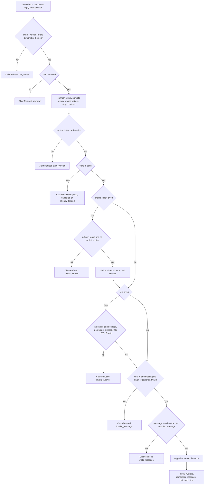
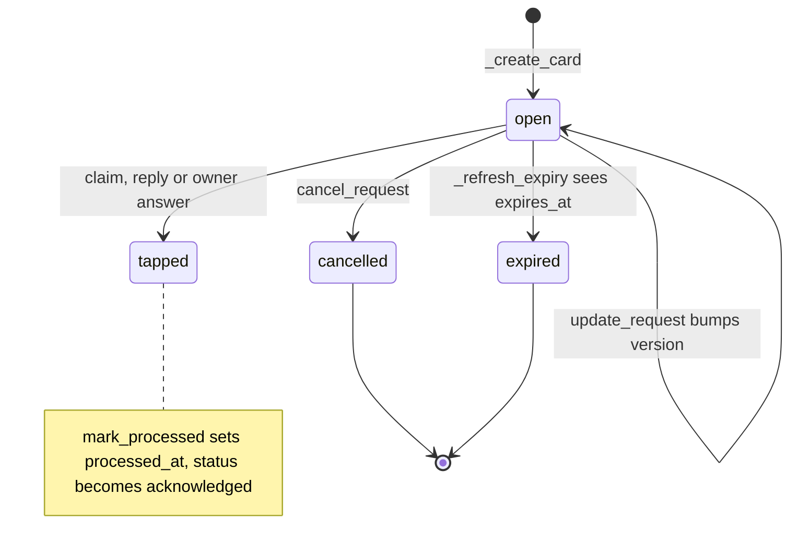

# Card lifecycle

## What a card is

A `Card` (`src/paraphe/inbox/card.py`) is one decision held for one owner. It
carries the caller's identity fields, the presentation fields the owner reads,
its revision, its liveness, the answer once there is one, and the destination's
message identity once a message exists. The lifecycle is a set of transitions on
that record, and every transition is written to the store before anything
outside the process is told about it.

Five properties define the shape of the rest:

- a card belongs to a **caller key** (`external_id`), not to a card id;
- its `state` is one of `open`, `tapped`, `cancelled` or `expired`;
- its liveness is a **deadline** (`expires_at`), not a queue position;
- its answer is bound to a **revision** (`version`), so a superseded answer is
  refusable rather than merely unlikely;
- the **store** is authoritative and the destination is a notifier, so every
  lifecycle decision is made by reading the stored card.

For the vocabulary of card, tap, owner and revision see
[the domain vocabulary](/openwiki/concepts/domain-vocabulary.md); for the tool
names, schemas and envelopes see
[the served MCP surface](/openwiki/architecture/mcp-surface.md).

## Creation is idempotent on the caller's key

`Inbox._create_card` requires an `external_id`, looks it up in the index rebuilt
from the store, and when the key is already known:

- refuses with `external_id kind mismatch` if the stored card has a different
  `kind`, so a question key cannot be silently reused for an approval;
- otherwise refreshes the card's expiry and returns it as a create view marked
  `duplicate: true`, after running the notification path — which is a no-op for
  a card whose reservation is on record, and re-attempts the send only when an
  earlier attempt was rejected and rolled back.

A retry after a timeout therefore cannot produce two decisions, which is the
property a caller on a flaky network depends on. A duplicate of an expired card
comes back with `status: expired` and `pending: false` and is not re-notified.
Repeating a create concurrently still yields one card: `call_tool` serializes
under the inbox lock.

A new card gets a fresh `uuid4` `request_id` and `expires_at = now + ttl`.
`_ttl` uses the configured default (four hours out of the box), and refuses a
value below the configured floor (fifteen minutes, itself never configurable
lower) or above the ceiling (thirty days) rather than clamping it, so a caller
learns it asked for something impossible. `rule_key` is accepted and validated
as a string and otherwise ignored.

## The store is written before the owner is told

`_notify_owner` reserves the notification: it saves a copy with `notified: true`
and only then calls the destination. Two failure paths follow from that order:

- **`NotifyRejected` and no message identity on the card** — the provider proved
  the send did not happen, so the reservation is rolled back (`notified: false`
  is saved) and a later retry or duplicate create sends again. If even that save
  fails, the rolled-back card is installed in memory only, so the running inbox
  does not re-send while a restart still fails closed on the stored reservation;
- **any other error** — the send may or may not have happened, so the
  reservation stays on record and the card is never notified again; the error
  still propagates to the caller. An ambiguous crash therefore cannot
  double-notify, which is the safe direction, and the card exists and is
  readable.

A payload written by an older release without a `notified` field is loaded as
already notified (`_card_from_payload`), so an upgrade does not re-send cards
the owner has already seen; `telegram_keyboard_attached` is likewise inferred
from a recorded message id.

`_ensure_store` opens the SQLite file and loads every card and every
notification external id into memory on first use; the `durable_state` table is
read by the tap transport for its poll offset, not by the inbox. It is
fail-closed: if a stored payload does not parse into a card, the store is closed
and the error propagates rather than serving from the rows it could read.

## Three owner-side doors, one ladder

An answer is never written by a tool on the agent's surface: only an owner-side
door can claim a card, and all three doors call `Inbox._claim_locked` while
holding the inbox lock, so the checks exist in exactly one place.

| Door | Entry point | Owner identity | Revision it presents | Answer shape |
|---|---|---|---|---|
| Telegram tap | `Inbox.claim(card_id, version=…, choice_index=…)` | `from_id == owner_telegram_id` | the version decoded from the button's callback data | a choice, resolved from the index |
| Owner reply | `Inbox.claim_reply(from_id=…, chat_id=…, message_id=…, text=…)` | `from_id` **and** `chat_id` equal the owner | the resolved card's own `version`, never the wire | free text, no choice |
| Local owner answer | `Inbox.answer(request_id, version=…, choice=…)` | `owner_verified=True`; the credential is proved at the boundary | the caller-supplied version | a choice |

`Inbox.answer` does no checking of its own: it calls `claim` with
`from_id=self.owner_telegram_id` and `owner_verified=True`, and the HTTP
`POST /answer` route passes `responded_via="answer-path"`. A second
implementation of the checks would be a second place for them to be wrong. The
tap door's transport, callback encoding and stale-keyboard handling live in
[the Telegram tap surface](/openwiki/integrations/telegram-tap-surface.md); the
credential that makes the local door owner-only is
[the credential boundary](/openwiki/security/credential-boundary.md).

## The claim ladder

Each door performs the owner check and the existence lookup — `claim` by card
id, `claim_reply` by the replied-to message id — and then `_claim_locked` runs
the rest of the checks in this order, refusing at the first that fails.

Every owner-side answer enters this one ladder; each check refuses with its own
reason before anything is written.

Details the diagram leaves out:

- the **owner** check happens at the door, before the store is even opened, so a
  stranger's message or callback cannot reach the ladder at all;
- the store is ensured between the owner check and the existence check;
- **expiry** runs before the version and state checks, so a card that expired
  while nobody was looking is recorded as expired first, and the refusal reason
  is then `expired` rather than `stale_version`;
- **state** maps to a reason: `expired` and `cancelled` are reported as
  themselves, `tapped` is reported as `already_tapped`, and the first answer on
  the card stands;
- **choice index** resolution falls back to `["Approve", "Deny"]` when the card
  carries no choices; a boolean or out-of-range index, or an index sent together
  with an explicit `choice`, refuses as `invalid_choice`;
- **text** is accepted only as a whole answer: it refuses as `invalid_answer`
  when it accompanies a choice or an index, is blank once stripped, or exceeds
  4096 UTF-16 units;
- **message identity** is all-or-nothing — one half given, a chat id that is not
  the owner's, or a message id that is a boolean, non-integer or non-positive
  refuses as `invalid_message`;
- a tap is compared against the card's recorded Telegram message only when the
  card has one; a mismatch is `stale_message`, an answer for a message the card
  no longer points at.

### What a refusal writes

Nothing. A refusal leaves the card exactly as it was — the same state, version,
answer and `processed_at` — and the only side effect is a control strip:

- `_claim_locked` asks the destination to strip that card's controls when it
  refuses on a card that is `tapped` or `cancelled`, so a leftover button cannot
  invite a second answer;
- it does **not** strip again for a card the refresh just expired, because
  `_refresh_expiry` already did;
- for `stale_version` and `stale_message` the strip is not done here at all: the
  tap adapter strips the leftover keyboard of that one message itself, after the
  refusal comes back.

## What a claim writes

Only after every check passes is the answer written: `state: tapped`, the
resolved choice, the reply text when the answer was words, `responded_at`,
`responded_via`, and — when the answer carried a message identity — that
identity with `telegram_keyboard_attached = True`. The claim then

1. saves the card through `_save`, which is the durable write;
2. sets the events of the in-process calls parked on that request id
   (`_notify_waiters`), after the durable write and never before;
3. tells the destination to remember the message, so a restart can still strip
   the keyboard (only when the answer carried a message identity);
4. asks the destination to strip the card's controls.

**There is no wake port.** A claim does not signal any external process: the
answer is picked up by the parked call returning from `_park`, or by the
reader's next boundary (`get_response`, `list_unprocessed`, `paraphe wait`). The
parking mechanism itself is
[the wait engine](/openwiki/architecture/wait-engine.md). A failed control strip
is swallowed on purpose — the answer is already durable, a dead destination is
an honest poll miss, and turning it into an error would make the caller believe
nothing was answered.

## The owner-reply door

`Inbox.claim_reply` turns an owner's long-press reply to a card message into
that card's answer. It resolves the card by the replied-to message id over the
loaded card state (`_card_by_telegram_message`), so a reply still resolves after
a process restart. Because the lookup is by the card's *current* message
identity, a reply to a message that a revision has superseded resolves to
nothing and is refused as `unknown` — the live message still answers — and a
reply to a status message (`notify_user`) matches no card at all.

The door requires both `from_id` and `chat_id` to be the owner, then passes the
resolved card's own `version` rather than a version from the wire. Two ladder
checks are therefore unreachable through this door: `stale_version` cannot fire
because the revision handed to the ladder is read from the card under the same
lock, and `stale_message` cannot fire because the identity handed to the ladder
is by construction the identity the card records. Staleness on the reply path
surfaces as `unknown` at the lookup instead.

The text is recorded verbatim as the card's answer — no choice, surrounding
whitespace preserved — with `responded_via="telegram-reply"`, and the card
closes exactly as a same-moment tap closes it: tapped state, `responded_at`, the
message identity, the keyboard flag, the durable write, the waiter wake and the
strip. Blank or oversized text is refused as `invalid_answer`. The adapter
swallows `ClaimRefused` for a reply and re-raises anything else, so a refusal
records nothing, wakes nothing and raises nothing, while a real failure such as
the durable write still surfaces. The intake rules themselves belong to
[the Telegram tap surface](/openwiki/integrations/telegram-tap-surface.md) and
[the ask/answer/resume workflow](/openwiki/workflows/ask-answer-resume.md).

## The recording shortcut, for tests only

`Inbox.record_tap` writes a tap directly. It requires only that the card exist
and be `open`, and it skips the owner check, the version check and the
message-identity checks. It sets choice, optional text, timestamp and
`responded_via` (default `"app"`), and it neither notifies waiters nor strips the
destination's controls. It has no production caller: the tap destination uses
`claim`, and the local answer path uses `answer`. The test suite uses it to put a
card into the tapped state, and nothing else should call it.

## Card state machine

The four persisted `state` values and the transitions between them; `acknowledged` is the derived status of a processed tap, not a state value.

## Revision, expiry and closeout

- **`update_request`** requires `request_id` and `expected_version`. It refuses
  when `expected_version` is not a positive integer (`expected_version is
  invalid`) or does not equal the card's current version (`expected_version does
  not match`), and when the card is not `open` — which includes a card whose
  expiry refresh just fired. Kind fields do not mix: a question card refuses
  `title`/`details`, an approval card refuses `question`/`context`/`choices`/
  `allow_freeform`. The caller's changes are applied, `expires_in_seconds`
  recomputes `expires_at`, and the version is bumped, so the previous revision's
  answer is refused as `stale_version`.
- Before the bumped revision can be answered, the previous message is retired:
  `telegram_chat_id`, `telegram_message_id` and `telegram_keyboard_attached` are
  cleared, and the destination is asked to strip the previous version's keyboard
  (`edit_and_strip(original.request_id, original.version)`). Ordering on failure
  is deliberate — if the strip raises, the previous revision is written back and
  the error propagates, so the store never advertises a revision whose message
  could not be closed; if the write succeeds and a requested `renotify` then
  fails, the bumped revision stays committed and the next update must carry the
  new `expected_version`. `renotify: true` also resets `notified`, re-sends the
  revised card, and marks the notification payload `renotify: true`.
- **`_refresh_expiry`** is the only place liveness changes. When a card is
  `open`, has an `expires_at`, and the clock has reached it, the card is saved as
  `expired`, waiters are notified, and the destination is asked to strip the
  controls. Because `_require_card`, `list_pending`, `list_unprocessed` and the
  claim ladder all route through it, expiry is a fact written once to the store
  rather than a computation each reader repeats — and an observed expiry is what
  wakes a parked call whose card nobody has tapped.
- **`mark_processed`** records that the agent acted on the answer. On the first
  call the card must be `tapped`, otherwise `card is not tapped`: a pending,
  cancelled or expired card cannot be closed out. It is idempotent — once
  `processed_at` is set, later calls return the same timestamp without a state
  check. Setting `processed_at` is what moves the envelope's status from
  `answered` to `acknowledged`; it does not change `state` and does not consume
  the answer.
- **`report_execution`** records what the agent observed after an approval. The
  `outcome` must be one of `accepted`, `rejected`, `completed`, `failed`; the
  card must have `kind == "approval"` (`report_execution is approval-kind`) and
  must already be `tapped` (`card is not tapped`). A `note` and a validated
  `result` object are stored, `execution_status` is set to the outcome, and a
  later report overwrites the earlier one — there is no idempotency guard here.
- **`cancel_request`** withdraws an open card. The reason is `cancelled` (the
  default) or `resolved_elsewhere`; anything else is `reason is invalid`. Only an
  `open` card transitions: the state is saved as `cancelled` with the
  `cancel_reason`, then waiters are notified and the destination is asked to
  strip the controls. Cancelling a card that is no longer open is not an error —
  the current envelope is returned unchanged, so the call is repeatable. After a
  cancel, the claim ladder refuses with `cancelled`.
- **`notify_user` is not a card.** It requires the create bearer and a `title`,
  and never writes a card, so it cannot appear in `list_pending`. An
  `external_id`, when supplied, is reserved in the store's `notifications`
  table — a namespace separate from the card `external_id` index — before the
  send, so a repeated key answers
  `{"ok": true, "duplicate": true, "kind": "notify"}` without sending again;
  without an `external_id` there is no key and every call sends. Only
  `NotifyRejected` rolls the reservation back (best effort — a failed delete
  leaves it reserved), so a timeout still reports duplicate on the retry, and an
  ambiguous outcome never notifies twice.

## Reading

`get_response`, `list_unprocessed` and `list_pending` hand back the envelope from
`_envelope`: `request_id`, `version`, `kind`, `pending`, `processed_at`,
`execution_status`, and a nested `response` object (`choice`, `text`,
`responded_at`, `responded_via`) that appears once the card is tapped.
`responded_via` reports how the answer actually arrived: `telegram` for a tap,
`telegram-reply` for the owner's reply, `answer-path` for the local owner
answer. `status` is derived by `_status`: `acknowledged` when `processed_at` is
set, otherwise `answered` for a tap, `cancelled`, `expired`, or `pending`.
`list_unprocessed` is the tapped cards with no `processed_at`; `list_pending` is
the cards whose refreshed state is `open`, newest first.

Reads never consume: the same envelope comes back until `mark_processed` runs.
That is what lets an agent that missed its answer recover by polling, and what
lets a second process inspect a card without stealing the answer from the first.
An unknown `request_id` is a tool error (`unknown request_id`), not a claim
refusal — a claim refusal is about one specific answer.

## Failure behaviour

| Situation | Behaviour |
|---|---|
| Duplicate create | the existing card is returned marked `duplicate`; the owner is not notified again unless an earlier send was rejected and rolled back |
| Duplicate key with a different kind | create refused with `external_id kind mismatch` |
| Store payload does not parse | the store is closed and the error propagates; no prefix of the store is served |
| Destination rejects the notification | the reservation is rolled back and the next attempt may send |
| Notification fails ambiguously | the reservation stays; the card is never notified again |
| Answer for a superseded revision | `stale_version`, card unchanged, nothing written |
| Answer after expiry | `expired`, and the card is recorded as expired first |
| Answer a second time | `already_tapped`; the first answer stands |
| Tap carries an index and a choice, or a bad index | `invalid_choice` |
| Text sent with a choice or an index, blank, or over 4096 UTF-16 units | `invalid_answer` |
| Answer names only one half of the message identity | `invalid_message` |
| Answer from a message the card no longer points at | `stale_message` |
| Reply to a message a revision superseded | resolves to nothing: `unknown`, and the live message still answers |
| Reply to a status message or from a non-owner chat | no card is claimed and nothing is recorded |
| Strip raises after a claim | swallowed; the answer stays durable and a second answer is still refused |
| Strip raises during `update_request` | the previous revision is written back and the error propagates |
| `renotify` fails after a committed revision | the bumped version stays committed; the error propagates |
| `mark_processed` on a card that is not tapped | `card is not tapped` |
| `report_execution` on a question card | `report_execution is approval-kind` |
| Create or read without the create bearer | `create bearer is required` |

## Focused tests

- `tests/inbox/test_tap_claims.py` — the claim ladder: non-owner refusal, expiry
  before the version check, `stale_version` after an update, the three terminal
  refusals, and that a failed strip neither authorizes a second answer nor
  unrecords the first.
- `tests/inbox/test_reply_intake.py` — the reply door: verbatim text with no
  choice and `telegram-reply`, lifecycle fields identical to a same-moment tap,
  the parked waiter waking with the text, resolution surviving a restart,
  refusals recording nothing and raising nothing, a reply to a status message,
  and a reply to a superseded message resolving to nothing while the live one
  answers.
- `tests/inbox/test_mcp_lifecycle.py` — idempotent creation including concurrent
  retries, the notify reservation against `NotifyRejected` and against ambiguous
  errors, save failures and restarts, expiry leaving `list_pending`, the
  `update_request` version guards, `mark_processed` idempotency,
  `report_execution` scope, `cancel_request` reasons, and `notify_user`
  duplicates.
- `tests/inbox/test_telegram_port.py` — callback data, message identity, the
  stripping of stale keyboards after a renotify, and the leftover-keyboard strip
  that follows a `stale_version` or `stale_message` refusal.
- `tests/inbox/test_wait_engine.py` — a parked call returning when a claim, a
  cancel or an observed expiry lands, and the card being reported at the
  window's end when nobody observes it.
