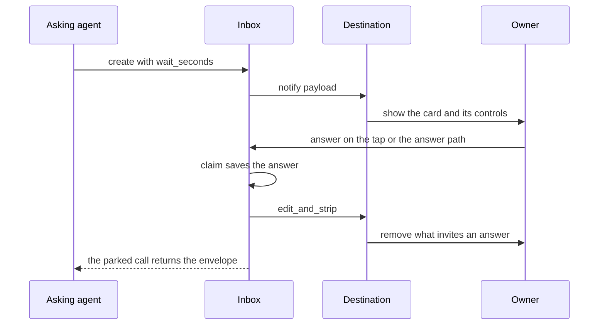

# Adapters: the destination seam

Paraphe has exactly one seam a contributor implements to add a destination, and
it is two methods. Everything specific to a runtime or a destination lives behind
it — the layout, the controls, the provider's own limits — while the card
lifecycle, the store and the credentials stay on the other side and never learn
what a destination is. `docs/adapters.md` is the contributor-facing copy of the
same contract; where prose and code disagree, `Inbox._notification_payload` and
the two shipped adapters are the authority.

## The destination contract

A destination is where the owner sees the card and answers it:

```python
class Destination:
    def notify(self, payload: dict) -> None:
        """Show the card to the owner. The inbox builds the payload:
        request_id, version, kind, title, details, choices, choice_notes,
        recommendation, consequence, prohibitions, links, agent_name, risk,
        expires_at, runtime, repo, worktree, ticket, plus renotify on a
        revised card."""

    def edit_and_strip(self, card_id: str, version: int) -> None:
        """The card is no longer answerable. Remove whatever invites an
        answer (buttons, a prompt) so no stale control stays on screen."""
```

Neither method returns anything the inbox uses, and nothing else is required.

### The payload the inbox builds

`Inbox._notification_payload` is the single place a card becomes a payload, and
it is the same dict for every destination:

| Payload key | Value |
|---|---|
| `request_id`, `version` | the card's id and its current revision |
| `kind` | `question`, `approval` or `feedback` |
| `title` | the card's `question` or its `title`, else `"Paraphe"` |
| `details` | the card's `context` or its `details` |
| `choices`, `choice_notes` | copies of the card's lists |
| `recommendation`, `consequence` | strings, or `None` |
| `prohibitions`, `links` | copies of the card's lists |
| `agent_name` | who asked |
| `risk` | `low`, `medium`, `high` or `critical` (the card's default is `medium`) |
| `expires_at` | the absolute expiry, in epoch seconds |
| `runtime`, `repo`, `worktree`, `ticket` | provenance, any of them `None` |
| `renotify` | present and `True` only on the re-send of a revised card |

The two ask kinds fill different halves of the same card — a question carries
`question`/`context`/`choices`, an approval carries `title`/`details` — and the
payload flattens both into one `title` + `details` pair, which is why a
destination should read the two names it is given rather than assume a kind's
spelling.

The payload is a curated subset, not the whole card. `priority`, `project`,
`source_thread`, `external_id`, `allow_freeform`, `expires_in_seconds` and the
lifecycle `state` are stored on the card but never sent; the deadline travels as
the absolute `expires_at` instead. `priority` is the one entry of the documented
field list in `docs/adapters.md` that the inbox does not set (the documented
`question/title` is the flattened `title`): a destination that reads it sees an
absent key, and the console prints exactly that. Both shipped implementations
read optional fields with `payload.get`, which is what makes an absent field
harmless rather than an error.

### The status-only branch of notify

`notify_user` is the one tool that never creates a card. It calls the notifier —
not the tap port — with a different shape:

```python
{"kind": "notify", "title": title, "message": message,
 "agent_name": shared["agent_name"], "risk": shared["risk"]}
```

There is no `request_id`, no `version` and no control to strip, so a destination
must branch on `kind == "notify"` before it treats a payload as a card. Both
shipped implementations do; the console prints one line and returns, and a card
payload without a request id and version is ignored outright rather than
rendered broken. A delivery is de-duplicated on `external_id` through the
store's notification-id table, and a `NotifyRejected` that carried an
`external_id` drops that reservation so a later call sends again.

### Two slots, not one

The two methods are injected separately, and each is consulted on its own:

- `Inbox(notifier=...)` — only `notify` is ever called on it; the default is
  `_NullNotifier`.
- `Inbox(telegram_port=...)` — only `edit_and_strip` is ever called on it; the
  default is `NullTelegramPort`.

One object may fill both slots, and in phone mode the Telegram adapter does. A
destination that only ever shows cards needs the first slot alone.

## When the inbox calls edit_and_strip

`edit_and_strip(card_id, version)` means "this card, at this revision, can no
longer be answered". Every call site is in the inbox, never in a destination:

| Call site | What happens |
|---|---|
| A claim lands — a tap, an owner reply or the local answer path | after the answer is saved and the parked waiters are woken, `_request_strip` |
| A refusal finds the card already closed | `_request_strip`, unless the refusal is what discovered the expiry — that strip already ran |
| A card expires | the state is saved as `expired`, the waiters wake, then `_request_strip` |
| `cancel_request` withdraws an open card | the state is saved as `cancelled`, the waiters wake, then `_request_strip` |
| `reconcile_notifications` at startup | every card that is not `open` is stripped |
| `update_request` retires the previous revision | `edit_and_strip(original.request_id, original.version)`, before the new revision is notified |

`_request_strip` is the swallowing wrapper: it catches every exception a
destination raises. `update_request` calls the destination method directly, so
it is the one site where a failing strip is not tolerated (see
[what a destination may raise](#what-a-destination-may-raise)). Both
implementations receive the revision being retired; the Telegram adapter ignores
the version argument and strips the message it remembers for the card, which
keeps a renotify correct — the superseded message is closed first, then the new
revision's message identity replaces it.

## Why adding a destination cannot change the lifecycle

Two methods are the whole contract, and the only other names the inbox looks for
are optional and reached with `getattr`:

- `remember_message` is probed before the inbox uses it, in
  `reconcile_notifications` (re-registering the message location of every
  loaded card that has one) and in a claim (so the strip that follows, and any
  later strip, still finds the message after a restart).
- `finalize_message` is probed in `_finalize_telegram`, which hands it the same
  notification payload `notify` would receive so a keyboard can be attached to a
  message that already exists.

A destination that defines neither still works: the probes find nothing and the
inbox continues. The restart behaviour those members serve — re-attaching a
keyboard instead of resending — is documented in
[the Telegram tap surface](/openwiki/integrations/telegram-tap-surface.md).

Because the inbox knows only those names, a new destination cannot change the
card lifecycle, and a lifecycle change cannot require a new method from an
existing destination. A destination that cannot do something (a plain text
channel with no controls, for instance) implements `edit_and_strip` as a no-op,
or as one printed line.

## Two shipped implementations, one contract

| | `paraphe.adapters.console` | `paraphe.adapters.telegram` |
|---|---|---|
| Purpose | the complete worked example; a first run with no external service | the runtime-specific mapping this product was built against |
| `notify`, status kind | one line: `[paraphe] title: message` | renders the identity line, kind line, title and message, and sends it with no keyboard |
| `notify`, card | a plain multi-line layout — a kind/risk header, the title/question, details/context, numbered choices, recommendation, "if ignored" consequence — and the exact `curl` that answers it | renders the card, sends it, records the message id, then attaches the inline keyboard by editing that message |
| `edit_and_strip` | prints that the card, at that revision, closed | strips the keyboard from the message it remembers |
| Extra surface | none | callback encoding and the update-consuming loop |

`ConsoleDestination` is deliberately complete and has no network call and no
dependency, so the loop can be exercised end to end before any bot exists. It is
constructed with the host and port the runtime is about to bind (the answer path
defaults to `/answer`, and a `write` callable can be injected, which is how the
tests read it), so the `curl` it prints names the same bind the answer path is
served on, with `PARAPHE_OWNER_ANSWER_TOKEN` as the credential — a configured
port of `0` leaves the printed port unhelpful, since the OS then chooses the real
one. It is what a first run gets, which is why a first run needs no external
service.

`TelegramAdapter` shows where the seam's edge is: the card's rendering and
budget, the `p1:` callback encoding that binds card id, version and choice into
Telegram's 64-byte limit, and the update intake all belong to it and never leak
into the inbox. None of that is repeated here — the card text and its
deterministic trimming live in
[the rendered Telegram card](/openwiki/integrations/telegram-card-rendering.md),
and the tap, callback and polling surfaces live in
[the Telegram tap surface](/openwiki/integrations/telegram-tap-surface.md).

## There is no delivery seam

A destination only shows the card (`notify`) and removes whatever invites an
answer (`edit_and_strip`). It never carries the answer back. The answer returns
through the ask itself (`docs/adr/0011-answer-returns-through-the-ask.md`):

- the **waited call** — `wait_seconds` (0–60) parks `ask_question`,
  `request_approval` or `get_response` until the owner answers inside the window
  or the window ends, and the call returns the answer envelope;
- the **waiter command** — `paraphe wait <request_id>` blocks until the card is
  answered or can no longer be answered, exiting `0` answered, `3` expired or not
  answerable, `4` unknown;
- the **read** — `get_response` and `list_unprocessed` read every answer with no
  waiter at all, so a caller that missed both windows drains the answer from the
  store at its next boundary.



The card's life at the seam: the destination is told, the answer enters through
the tap or the answer path, and the asking call reads it back.

The destination is an outbound seam: the claim writes the answer to the store and
strips the controls, and the asking call reads the answer back — no step returns
through the destination. A client that parked nothing reads with `get_response`,
`list_unprocessed` or `paraphe wait`.

Silence is never approval and the store stays the source: a missed wait, a dead
waiter or an expired window all fall back to the same durable read, whose engine
is in [the wait engine](/openwiki/architecture/wait-engine.md). Because nothing is
resumed from a destination, the `source_thread` a caller sends is descriptive
metadata — the card stores the value it was given, and a test pins exactly that.

An owner's text reply is an answer, not a notification. `TelegramAdapter`
resolves a private-chat reply to a card message by the replied-to message id and
calls `Inbox.claim_reply`, which records it with the same lifecycle writes a tap
makes and marks the envelope `responded_via="telegram-reply"`; a reply to a
status message resolves to no card, so it records nothing. It enters through the
adapter as an owner-side answer and never touches `notify`. That intake path has
its own page: [owner reply intake](/openwiki/integrations/owner-reply-intake.md).

## Who chooses the destination

`Inbox` takes an optional `notifier` and an optional tap port, and both default
to no-ops (`_NullNotifier`, `NullTelegramPort`), so an inbox with no destination
wired still starts, still serves creates and still answers — it simply notifies
nobody. The composition root is what picks a real one: `Runtime.start` chooses
from configuration and assigns the object into the inbox's slots (see
[composition root and runtime](/openwiki/architecture/composition-root-and-runtime.md)).

| Configuration | Destination | Wired as |
|---|---|---|
| `bot_token` present | `TelegramAdapter` | notifier and tap port |
| `bot_token` absent | `ConsoleDestination(host, port)` | notifier only, with the null tap port |

A bot token means the tap adapter; its absence means the console. In console mode
the null tap port is what receives `edit_and_strip`, so a running console-mode
server prints the card it shows and does not print the "card closed" line; the
console's `edit_and_strip` is exercised by the tests and is available to an
embedder that wires it in both slots.

## What a destination may raise

The inbox notifies each card revision at most once: the `notified` reservation is
stored before `notify` is called, so a duplicate create or a restart does not
re-send — only an `update_request` with `renotify` clears the flag and sends the
new revision with `renotify: true`.

- A **failing `notify`** happens after the notification reservation has been
  stored. If the provider proved the send did not happen (`NotifyRejected`) and no
  message identity was recorded, the reservation rolls back so the next create or
  reconcile retries; any other exception propagates to the caller.
- A **failing `edit_and_strip`** is swallowed on a claim, a refused claim, an
  expiry, a cancel and a reconcile: the answer is already durable, so a dead
  destination is an honest miss rather than a failed answer. On `update_request` it
  is not swallowed — a raise writes the previous revision back and propagates, so
  the store never advertises a revision whose previous message could not be closed.
  The ordering is in
  [the card lifecycle](/openwiki/architecture/card-lifecycle.md).

## The surface the destination notifies for

The cards a destination shows come from twelve tools: `how_to_use`,
`ask_question`, `request_approval`, `get_response`, `list_unprocessed`,
`list_pending`, `mark_processed`, `report_execution`, `update_request`,
`cancel_request`, `notify_user` and `request_feedback` (`TOOL_NAMES`). A
destination is not one of them, and adding one adds no tool and changes no tool's
behaviour. The registry's own contract is documented in
[the served MCP surface and envelope](/openwiki/architecture/mcp-surface.md).

## Focused tests

- `tests/inbox/test_surface_contract.py` pins the destination contract: the
  console implementation's `notify` and `edit_and_strip` both run through the
  printed output, the served tool names match the documented table, and the
  stored `source_thread` is the value the caller sent.
- `tests/inbox/test_setup.py` asserts the console destination's printed card
  carries the request id, the `/answer` path and `PARAPHE_OWNER_ANSWER_TOKEN`.
- `tests/inbox/test_mcp_lifecycle.py` drives destinations directly: a rejected
  notify rolls the reservation back and a retry sends once, an unknown notify
  failure does not duplicate after a restart, and a renotify failure exposes the
  committed revision rather than a half-updated card.
- `tests/inbox/test_tap_claims.py` asserts a failing strip neither authorises nor
  unrecords an answer.
- `tests/inbox/test_runtime.py` asserts the composition root wires the same
  adapter as the inbox's notifier and tap port in phone mode.
- `tests/inbox/test_telegram_port.py` covers the tap adapter, including the
  failed-revision strip that keeps the previous version; see
  [the Telegram tap surface](/openwiki/integrations/telegram-tap-surface.md).
