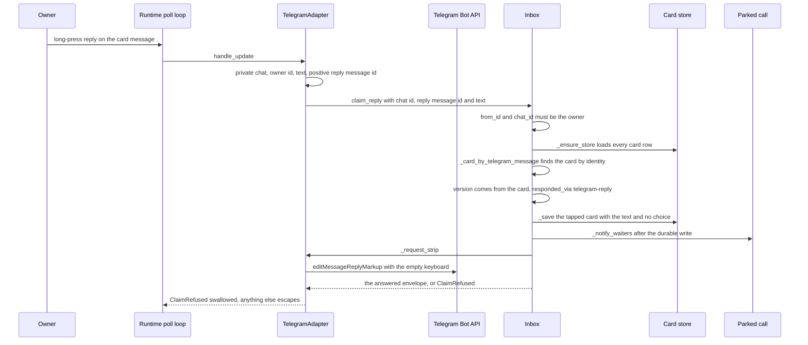

# Owner replies as answers

A tap is not the only way the owner answers. In the private chat the owner can
long-press any decision card and reply to that message; the words are intake for
the card the reply targets, not chat. `TelegramAdapter` turns the message into an
owner answer through the same claim ladder a tap uses, and the words come back to
the asking run through the shipped return path
([the wait engine](/openwiki/architecture/wait-engine.md),
[the ask/answer/resume workflow](/openwiki/workflows/ask-answer-resume.md)). No
new tool, route or wake port exists for it: the reply is an owner answer entered
through the destination seam, which
[adapters and the tool surface](/openwiki/extension/adapters-and-tool-surface.md)
describes as outbound.

Two halves do the work. The adapter decides that a message *is* a reply attempt
and which message it targets; the inbox decides whether that reply becomes an
answer and records it. The card renderer is what tells the owner the gesture
exists: every decision card ends with the reply hint line, `Reply to this message
to answer in your own words or ask a question.` — status messages do not
([card rendering](/openwiki/integrations/telegram-card-rendering.md)).

## Where a reply enters

`TelegramAdapter.handle_update` handles two update shapes and ignores everything
else: a `callback_query` first, then a text message. For a message the adapter
requires, in order:

- `from` and `chat` are objects and `text` is a string;
- `chat.type` is `private`, the chat id is the configured owner id, and the sender
  id is the same owner id (`_owner_id`);
- `reply_to_message` is an object carrying a **positive integer** `message_id`.

When those hold it calls `_on_reply(chat_id, reply_message_id, text)` and returns
an empty list. The reply branch sits before the `/config` branch, so a reply whose
text happens to start with `/config` is still an answer attempt and never a
command. A plain message to the bot — no `reply_to_message` — is not an answer
attempt at all; it falls through to the `/config` stub or to nothing. Everything
the adapter rejects here is dropped before any claim runs.

`_on_reply` then calls `Inbox.claim_reply(from_id=..., chat_id=...,
message_id=..., text=...)` and catches the outcome. The door's own authority check
is `from_id != owner_telegram_id or chat_id != owner_telegram_id → not_owner`; the
adapter passes **its own** owner id as `from_id`, because it has already compared
the message's sender to that id. The refusal is still real code with a real
caller: it is what a direct caller gets, and what an adapter whose owner id
disagrees with the inbox's configured id would produce.

The reply never goes through `notify`, and no value of `handle_update` is ever
sent back to Telegram. The return value is discarded by the poll loop, and a
reply — unlike a tap — has no `answerCallbackQuery` to answer, so there is no
toast channel at all.

## Resolution, and why it survives a restart

`claim_reply` takes the inbox-wide lock, checks the owner, calls `_ensure_store()`,
and resolves the card with `_card_by_telegram_message(chat_id, message_id)`: a scan
of the loaded card state for the card whose stored `telegram_chat_id` and
`telegram_message_id` equal the replied-to identity. Those two columns are written
when the message is sent — before any keyboard is attached — and persisted with the
card, so the binding is durable state, not adapter memory. `_ensure_store` loads
every card row into `self._cards` on first use after construction, which is why the
adapter's in-memory location map is never consulted here. The restart test proves
the property end to end: a reply after a fresh process still answers the card.

The adapter's map does matter for the **strip**, and the reply path repairs it:
`_claim_locked` asks the port to `remember_message(...)` before asking it to
`edit_and_strip(...)`, and at startup `reconcile_notifications` re-remembers every
stored identity. A reply therefore closes the message it answered even in a
process that never sent it.

Resolution is by the card's *current* identity, which has two consequences worth
knowing:

- a reply to a message that `update_request` superseded matches no card and is
  refused `unknown` — the live message still answers;
- if two cards ever recorded the same identity, the first match in dict order
  wins. Nothing enforces uniqueness of `(chat_id, message_id)`; the adapter records
  one identity per message it sends, and the lookup key is the replied-to id.

## The ladder: identical code, unreachable checks

`claim_reply` hands `_claim_locked` the resolved card's **own** `version`, the
identity it was found by, `text`, and `responded_via="telegram-reply"`, with no
choice and no choice index. That is the same method a tap's `claim` reaches, so the
owner check, the expiry refresh, the version check, the state check, the text
validation, the message-identity checks, the write, the waiter wake and the strip
are the same code — not a parallel implementation. What differs is only what
arrives:

| | tap (`_on_callback` → `claim`) | reply (`_on_reply` → `claim_reply`) |
|---|---|---|
| what arrives | a `callback_query` whose `data` is a `p1:` token: card id, version, choice index | message text only: no card id, no version, no choice index |
| the version handed to the ladder | decoded from the token, i.e. bound when the button was rendered | the resolved card's own `version`, read under the same lock |
| how the card is found | the card id decoded from the token | the replied-to message id over the loaded card state |
| wire validation | `decode_callback_data` (prefix, UUID, version ≥ 1, index 0–3), and every callback is answered with `answerCallbackQuery` | the adapter's shape check only; nothing is sent back, there is no toast for a reply |
| answer envelope | `choice` set, `text` null, `responded_via` `telegram` | `choice` null, `text` is the owner's words, `responded_via` `telegram-reply` |

Four ladder refusals are unreachable through the reply door, because the door
supplies values the ladder cannot find stale or malformed:

- `stale_version` — the version passed is read from the same card object under the
  same lock, so it always equals the card's version. A superseded revision surfaces
  as `unknown` at the lookup instead.
- `stale_message` — the identity passed is by construction the identity the card
  records.
- `invalid_message` — the message-identity shape check passes, since both halves of
  a valid owner identity are supplied together.
- `invalid_choice` — there is no choice and no index.

Reachable through the reply door: `not_owner`, `unknown`, `expired`, `cancelled`,
`already_tapped` and `invalid_answer`. Blank or whitespace-only text, or text over
4096 UTF-16 units, is refused `invalid_answer`; the text that is recorded is
verbatim, surrounding whitespace included, because no path trims it.



One reply, from the long poll to the wake: the door resolves and claims, the
durable write precedes the wake, and the strip closes the message.

The accepted reply writes exactly what a same-moment tap writes, minus the choice:
`state` `tapped`, `response_text` with the words, `responded_at`, `responded_via`
`telegram-reply`, the message identity with `telegram_keyboard_attached` true, and
no `response_choice`. Then, in order, `_save` (the durable write), `_notify_waiters`
so parked calls return, `remember_message` on the port, and `_request_strip` so the
message stops inviting an answer. A strip that fails is swallowed — the answer is
already durable — exactly as on the tap path
([card lifecycle](/openwiki/architecture/card-lifecycle.md)).

## What a reply is refused for, and what a refusal costs

Refusals are recognized by class **name**: the adapter imports nothing from the
inbox and re-raises any exception that is not a `ClaimRefused`. The contract the
code has:

| Situation | Behaviour |
|---|---|
| Stranger's message, group chat, foreign private chat, non-string text | dropped in the adapter before any claim; nothing written, nothing sent |
| Plain message to the bot with no reply target | not a reply attempt; `/config` or nothing |
| `reply_to_message` without a positive integer `message_id` | ignored entirely |
| Text blank, whitespace-only, or over 4096 UTF-16 units | ladder refuses `invalid_answer`; the card is unchanged |
| Reply to a status message sent by `notify_user` | `notify_user` writes no card at all, so no card carries that message id; the lookup finds nothing, the refusal is `unknown`, and it is swallowed — nothing recorded, nothing raised |
| Reply to a message a revision superseded | `unknown` at the lookup; the live message still answers |
| Reply to a cancelled card | `cancelled`; no card write, the card is unchanged |
| Reply to a card that already has an answer | `already_tapped`; the first answer stands and **no new card state is written** — the ladder only re-issues the strip before raising |
| Reply to an open card past `expires_at` | the expiry refresh writes `expired` first, waking waiters and stripping, and then `expired` is refused |
| Direct `claim_reply` from a non-owner id, or owner ids that disagree | `ClaimRefused("not_owner")`, raised to the caller |
| Any other failure — the durable write, a store that will not open | escapes `_on_reply`, then `handle_update`, then the poll loop, whose narrow catch covers only `TelegramAPIError` and `NotifyRejected`, so the runtime closes |

So the whole quiet-failure contract is: a refusal records nothing, wakes nothing
and raises nothing. Only a real failure escapes the adapter. Because a refusal
sends nothing to Telegram, the owner gets no notice that a reply was refused —
taps have a toast, replies have no equivalent channel yet, and a courtesy notice
is explicitly deferred
([the card context and reply plan](/docs/plans/2026-09-11-1604-feat-card-context-and-reply-plan.md)).

## What the reader gets

The answer is read the same way a tap is. `_envelope` includes a `response` object
once the card is tapped, and for a reply it is:

```json
{
  "request_id": "…",
  "status": "answered",
  "version": 1,
  "response": {
    "choice": null,
    "text": "the owner's words, unchanged",
    "responded_at": "…",
    "responded_via": "telegram-reply"
  },
  "processed_at": null,
  "execution_status": null,
  "kind": "approval",
  "pending": false
}
```

`status` is `answered` while the card is tapped and unprocessed; `mark_processed`
sets `processed_at` and the same response object is still there under status
`acknowledged`. `get_response` and `list_unprocessed` return this envelope without
consuming it, `list_unprocessed` being exactly the tapped cards with no
`processed_at` — a reply is one of them. A call parked with `wait_seconds` (on
`ask_question`, `request_approval` or `get_response`) returns it as soon as
`_notify_waiters` fires, and `paraphe wait <request_id>` repeats the bounded window
and prints the same envelope JSON, exiting 0 for `answered` or `acknowledged`, 3
for `expired` or `cancelled`, and 4 for an unknown id
([the ask and wait commands](/openwiki/integrations/ask-and-wait-cli.md),
[the MCP surface](/openwiki/architecture/mcp-surface.md)). So the asking run
learns the owner's words with no announcement in chat and no new transport — the
reply rides the return path unchanged.

## The protocol rule: a question is not a decision

Nothing server-side classifies the reply. Whatever the owner types is recorded
verbatim as the card's answer and closes the card, exactly as a tap does. The rule
about question-like replies therefore lives in what the surface *teaches* the
agent, not in a check:

> The owner may answer a card with a reply instead of a tap: the reply text arrives
> as response.text with responded_via telegram-reply, and the card closes exactly
> as a tap. A reply that is a question or not a decision is not a decision: do not
> execute it — explain, then re-ask with a fresh card.

The served `how_to_use` text says exactly that, the `get_response` descriptor says
an owner reply arrives as `response.text` with `responded_via telegram-reply`, and
[the tool guide](/docs/tools.md) repeats the interpretation rule alongside the
`responded_via` vocabulary (`telegram` tap, `telegram-reply` reply, `answer-path`
local owner answer). The suite pins that the served text keeps teaching it.

One operational consequence: the card has already closed, so a genuine re-ask is a
**new** create with its own stable `external_id`. Reusing the closed card's
`external_id` hits the duplicate path, returns the answered card marked
`duplicate`, and re-notifies nobody, because the notification reservation is
already on record for it. Reviving the same card for a question reply was
deliberately deferred.

## The credential boundary is untouched

Reply intake is owner-side, like the tap. It has no bearer: `claim_reply` is not an
MCP tool, is not reachable over the HTTP surface, and its authority is the owner's
Telegram user id and private chat — checked by the adapter before the call and
again by the door. The agent credential still creates and reads and can never
answer, no served tool name carries `answer` or `claim` as a segment, and the local
owner answer path remains the only other answer door. That asymmetry is
[the credential boundary](/openwiki/security/credential-boundary.md).

## Focused tests

| Behaviour | Test |
|---|---|
| the words are recorded verbatim, `choice` null, `responded_via` `telegram-reply`, keyboard stripped | `tests/inbox/test_reply_intake.py::test_reply_records_the_owners_words_verbatim` |
| a reply writes the same lifecycle fields as a same-moment tap, both keyboards stripped | `tests/inbox/test_reply_intake.py::test_reply_writes_the_same_lifecycle_as_a_same_moment_tap` |
| a parked waiter wakes holding the text | `tests/inbox/test_reply_intake.py::test_reply_wakes_the_parked_waiter_with_the_text` |
| the reply still resolves after a restart | `tests/inbox/test_reply_intake.py::test_reply_resolves_after_a_restart` |
| refusals record nothing, raise nothing, wake nothing; a second reply on a closed card leaves the first answer; a direct non-owner `claim_reply` is `not_owner` | `tests/inbox/test_reply_intake.py::test_refusals_record_nothing_raise_nothing_and_wake_nothing` |
| a reply to a status message is not an answer | `tests/inbox/test_reply_intake.py::test_reply_to_a_status_message_is_not_an_answer` |
| a reply to a superseded message resolves to nothing while the live message answers | `tests/inbox/test_reply_intake.py::test_reply_to_a_superseded_message_resolves_to_nothing` |
| the served text teaches `telegram-reply` and `re-ask` | `tests/inbox/test_surface_contract.py::test_the_served_text_teaches_the_reply_rule` |

The claim ladder itself, the waiter mechanics and the keyboard lifecycle have their
own witnesses on [card lifecycle](/openwiki/architecture/card-lifecycle.md),
[the wait engine](/openwiki/architecture/wait-engine.md) and
[the Telegram tap surface](/openwiki/integrations/telegram-tap-surface.md).
