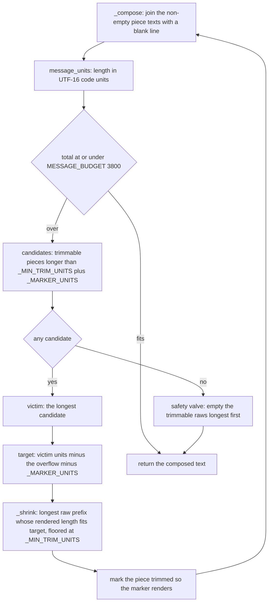

# The rendered card

`render_card` in `src/paraphe/adapters/telegram.py` is the layout owner the
destination holds, not the asking agent. It turns the notification payload into
one Telegram HTML string in a fixed section order, measures it the way Telegram
measures a message, and trims it deterministically when it does not fit. It is a
pure function: no socket, no store, no state — chat ids, message ids and versions
are used by the send and keyboard half of the adapter *after* the text exists.
[The Telegram tap surface](/openwiki/integrations/telegram-tap-surface.md) covers
that half; [owner replies as answers](/openwiki/integrations/owner-reply-intake.md)
covers what the card's reply hint leads to; the payload it consumes is documented
in [adapters: the destination seam](/openwiki/extension/adapters-and-tool-surface.md).

## Where the renderer sits

`TelegramAdapter.notify` is the renderer's only production caller:

```python
def notify(self, payload):
    text = render_card(payload)
    if payload.get("kind") == "notify":
        self._api.send_message(self._owner_id, text, None, parse_mode="HTML")
        return
    self.send(payload, text=text)
```

Both branches send the rendered string with `parse_mode="HTML"`, which is why
escaping is not optional (see below). The status branch makes one call and stops:
no keyboard, no `record_telegram_message`, no remembered message location. The
decision branch goes through `send`, which records the message identity, remembers
the location and attaches the inline keyboard by editing the message.

The console destination never calls the renderer: layout belongs to each
destination, and `paraphe.adapters.console` prints its own plain layout from the
same fields. `render_card` is imported by tests only otherwise.

## The payload the renderer reads

`Inbox._notification_payload` is the single place a card becomes a payload for a
decision card (a status payload is built inline in `_notify_user`). The renderer
reads exactly these keys:

| Payload key | Landed as |
|---|---|
| `agent_name`, `runtime`, `repo`, `worktree`, `ticket` | the identity line (first section) |
| `kind` | the shape decision (status or decision) and the kind line |
| `risk` | `· risk <word>` on the kind line, when `high` or `critical` |
| `title` | the bold title |
| `details` | the context section of a decision card |
| `message` | the body of a status message |
| `choices`, `choice_notes` | the numbered options block |
| `recommendation` | the `(recommended)` mark on the matching option and the `Recommended:` line |
| `consequence` | the `If approved:` line |
| `prohibitions` | the `Limits:` list |
| `links` | the `Links:` anchors |
| `expires_at` | the `Expires:` line of a decision card |

Everything else in the payload is ignored by the renderer. `request_id` and
`version` feed `send` and `_markup`, never the text; `renotify` (present and
`True` on a re-sent revised card) does not alter the text, so a renotify renders
identically to the first send; `priority`, `project`, `source_thread`,
`external_id` and `allow_freeform` reach no destination at all — `priority`,
`project` and `source_thread` are not even placed in the payload. A card's
free-form answer surface on the phone is therefore the reply hint, not a rendered
`allow_freeform` flag.

Every lookup is an optional `payload.get`, which is what makes an absent field
harmless: the renderer drops the section instead of inventing a placeholder.

## The two shapes

A **decision card** (`kind` of `question`, `approval` or `feedback`) renders the
full order. A **status message** (`kind == "notify"`) renders the identity line,
the kind line, the bold title and the `message` body — and nothing else.

| # | Section | Rendered as | Trimmable |
|---|---|---|---|
| 1 | identity line | `agent_name` · `runtime` · `repo` · `worktree` · `ticket`, present values only | no |
| 2 | kind line | `KIND_LABELS[kind]`, plus ` · risk high\|critical` | no |
| 3 | title | `<b>…</b>` | no |
| 4 | context | `details`, escaped | yes |
| 5 | options | `1. <choice>` + ` (recommended)` + ` — <note>` per choice | yes |
| 6 | recommended | `<b>Recommended:</b> ` + `recommendation` | yes |
| 7 | consequence | `<b>If approved:</b> ` + `consequence` | yes |
| 8 | limits | `<b>Limits:</b>` then one `- <item>` line per `prohibitions` entry | yes |
| 9 | links | `<b>Links:</b>` then one anchor per `links` line | yes |
| 10 | reply hint | the `REPLY_HINT` constant | no |
| 11 | expiry | `Expires: YYYY-MM-DD HH:MM:SS UTC` from `expires_at` | no |

*In the status shape, section 5 is replaced by the escaped `message` body, and the
reply hint and expiry are absent. Sections are joined by a blank line and any
section whose text is empty is skipped, so a card with no links simply has no
`Links:` block.*

Shape of a decision card (synthetic values, sections elided):

```text
example-agent · Claude Code · example-repo · feature-x · ticket-42

Approval · risk high

<b>Publish the docs folder only?</b>

The tree also holds one unrelated change; the window is now.

1. Approve (recommended) — publish now, off-hours
2. Deny — leave the tree as it is

<b>Recommended:</b> Approve
… Limits: …, Links: …
Reply to this message to answer in your own words or ask a question.

Expires: 2026-05-04 09:15:00 UTC
```

The status shape is pinned verbatim by the tests:

```text
Hermes

Status

<b>Nightly sync finished.</b>

Two warnings; nothing failed.
```

## The identity line

`_identity_line` walks a fixed key order — `agent_name`, `runtime`, `repo`,
`worktree`, then `ticket` — and joins the truthy values with ` · `. Absent fields
are omitted, never guessed: the line shrinks to a single name, and to nothing at
all on a card with no provenance, in which case the kind line becomes the first
line of the message. `ticket` is special-cased: a value containing `://` renders
as a tappable anchor, a plain ticket string renders as escaped text.

That is also why the integration test in `tests/inbox/test_surface_contract.py`
reads `text.split("\n", 1)[0]` to assert the identity line of a card created
through `ask_question`.

## The kind line

`_kind_line` maps `question` / `approval` / `feedback` / `notify` to `Question` /
`Approval` / `Feedback` / `Status`, falling back to `kind.capitalize()` for an
unexpected value, and appends ` · risk high` or ` · risk critical` for those two
risks only (`low` and `medium` stay silent). The rule is shared by both shapes,
and the `notify` payload carries `risk`, so a high-risk status message shows the
word too. An empty or missing `kind` yields an empty label and no kind line.

## Options, notes and the recommendation

`_options_lines` builds raw text that is escaped later with the rest of the
section:

- every choice is numbered `index + 1`, so the numbers align one-to-one with the
  order `_markup` enumerates into the keyboard;
- ` (recommended)` is appended to the **first** choice whose stripped text equals
  the stripped `recommendation`; a recommendation that matches no choice leaves
  every option unmarked (the `Recommended:` line still renders it);
- the parallel `choice_notes[index]` entry is appended after an em dash when it
  exists and is truthy; notes past the end of `choices` are ignored.

### The numbers are a legend; the buttons are the surface

The numbered list exists so the option set is readable as text. It is not the
answer channel: a tap carries a `p1:` token binding the card id, the card version
and the choice **index**, and the inbox resolves that index against the card's own
choices when the claim runs. Nothing parses a number out of the rendered message,
which is why editing the text cannot fabricate an answer, and why the labels can
change without changing what an answer means.

One asymmetry follows from the same code path. When a card carries no `choices`,
the renderer emits no numbered block while `_markup` (keyboard) and
`_claim_locked` (validation) both fall back to `["Approve", "Deny"]`. Because
`request_approval` and `request_feedback` reject `choices` at create time and only
`ask_question` and `update_request` set them, an approval card's options normally
exist **only** as buttons — the text shows no options at all. The two halves are
derived from the same list, so they cannot drift once choices exist.

## Escaping: nothing on a card can inject markup

Every interpolated value goes through `_sanitize` and then `_escape`:

- `_sanitize` does a `str(value).encode("utf-8", "replace").decode("utf-8")`
  round-trip, replacing a lone surrogate rather than letting a field fail the
  send;
- `_escape` is `html.escape(..., quote=False)` — `&`, `<` and `>` become entities,
  quotes are left alone;
- `_link` wraps a URL in `<a href="…">…</a>` with the href escaped `quote=True`
  and the visible text escaped `quote=False`, and `_render_links` applies it per
  non-empty line of the links block.

The only markup that survives a field full of metacharacters is the renderer's
own: the title's bold pair and the four bold labels (`Recommended:`,
`If approved:`, `Limits:`, `Links:`). The escaping test asserts exactly that
count — five `<b>` and five `</b>` — plus that `<script>`, `<i>` and friends come
out as text.

## Measuring: UTF-16 code units

`message_units(text)` is `len(text.encode("utf-16-le")) // 2` — the length as
Telegram counts it, where an astral code point is two units. `PLATFORM_LIMIT` is
4096 (Telegram's per-message ceiling), `MESSAGE_BUDGET` is 3800 (clear headroom),
and the inbox's own bound on an owner reply's length uses the same expression, so
the two surfaces agree on what a message length is.

| Constant | Value | Role |
|---|---|---|
| `PLATFORM_LIMIT` | `4096` | Telegram's hard per-message limit |
| `MESSAGE_BUDGET` | `3800` | the budget the renderer aims to stay under |
| `TRIM_MARKER` | `… [trimmed]` | appended to each trimmed section |
| `REPLY_HINT` | `Reply to this message to answer in your own words or ask a question.` | the last decision-card section before the expiry |
| `_MIN_TRIM_UNITS` | `40` | the lower bound on the target `_shrink` is given, so a trimmed section keeps a head of up to about this size rather than being erased |

## The trim loop

A `_Piece` is one section: fixed markup in `prefix` / `suffix` around a cuttable
`raw` value plus a `render` callable (`_escape` by default, `_render_links` for the
links block). `_Piece.text()` is `prefix + render(raw) + marker + suffix`, with the
marker present only once the piece has been trimmed, so the visible marker is a
property of the section rather than of the whole message. `_compose` joins the
non-empty piece texts with a blank line.



The loop and its rules, in the code's own terms:

- the **victim** is `max(candidates, key=...)` over the trimmable pieces, so ties
  and multi-round trims are resolved by size, identically on every run;
- the **cut** is `_shrink`, a binary search over the raw value for the longest
  prefix whose *rendered* length fits the target — so escaping decides where the
  visible cut falls, and a section always keeps its head and loses its tail;
- the **floor** is `max(target, _MIN_TRIM_UNITS)`, so a trimmed section is cut to a
  head of up to about forty rendered units rather than erased, and the eligibility
  threshold (`_MIN_TRIM_UNITS + _MARKER_UNITS`) keeps short sections whole;
- each round strictly reduces the measured total, and the loop recomposes before
  measuring again, so it always terminates and, while candidates remain, ends at
  or under the budget;
- the **safety valve** exists so the function stays total if no candidate
  qualifies: it empties the trimmable raws longest-first until the message fits
  and returns whatever remains. The code records it as unreachable with the
  bounded field set — it is a guarantee that the renderer returns a string
  instead of raising, not a proof that the result fits.

Because sections 1–3 and 10–11 are not trimmable, trimming can never remove the
title or the reply hint: after the heaviest trim the owner still sees what the
card is about and how to answer it, plus the `… [trimmed]` marker wherever
content was cut.

That same property is the boundary of the budget claim. Trimming can only give up
*trimmable* content, so a message that is over budget while the trimmable sections
are already short cannot be brought down, and the renderer returns it as is.
Escaping is what makes that reachable in principle: `&` expands fivefold, and a
`ticket` that is a URL is escaped twice — once inside the href and once as the
visible text — so an entity-heavy ticket of the schema's full 200 characters can
account for roughly 2000 units of the identity line on its own, with the title
bounded the same way at about 1000. Such a card would be sent over
`PLATFORM_LIMIT` and Telegram would reject it — a `NotifyRejected`, the same
failure kind
[the tap surface](/openwiki/integrations/telegram-tap-surface.md) shows rolling
back the notification reservation — rather than the renderer failing. Ordinary
card content, and the fixtures in the suite, stay far away from this edge.

## Invariants a change must preserve

| Invariant | Witness |
|---|---|
| Rendering is total and never raises on hostile or oversized field text: lone surrogates are replaced, everything interpolated is escaped | `tests/inbox/test_card_renderer.py::test_lone_surrogates_cannot_fail_the_render`, `::test_markup_metacharacters_are_escaped_and_never_injected`, `::test_oversized_content_trims_with_a_visible_marker_under_budget` |
| Length is computed in UTF-16 code units, the way Telegram counts | `::test_emoji_content_is_budgeted_in_utf16_units` (2100 emoji, 4200 units) |
| The trim victim is chosen deterministically, the cut keeps the head, and the marker is visible | `::test_trim_order_is_longest_free_text_first` |
| A second render of the same payload is identical | `::test_full_card_renders_the_pinned_fixture` (asserts the fixture and renders twice) |
| The whole composed string is pinned for a fully populated card and for a status message | `::test_full_card_renders_the_pinned_fixture` (`FULL_EXPECTED`), `::test_status_message_renders_identity_and_no_decision_sections` |
| The identity line renders present fields in order and invents nothing | `::test_identity_line_renders_present_fields_in_order_and_invents_nothing`, `::test_status_without_provenance_has_no_identity_line` |
| A `ticket` that is a URL renders as a link, a plain ticket does not | `::test_url_ticket_renders_as_a_link` |
| A payload the inbox actually builds renders its identity line | `tests/inbox/test_surface_contract.py::test_a_created_card_renders_its_identity_line_from_the_payload` |

## Focused tests

`tests/inbox/test_card_renderer.py` is the renderer's own module and the only
place the layout is pinned. It imports the shipped module (`paraphe.adapters.telegram`)
and asserts on `render_card`, `message_units`, `MESSAGE_BUDGET` and `TRIM_MARKER`
read from it, so a constant moved or renamed fails loudly. `FULL_EXPECTED` is the
fixture that matters: any change to section order, labels, spacing, escaping or
the expiry format has to update it deliberately rather than silently.

The suite is run as
`python3 -m unittest discover -s tests -p 'test_*.py'`
([suite and integration](/openwiki/testing/suite-and-integration.md)); the
renderer module is one of the modules under `tests/inbox/`.

## Related pages

- [The Telegram tap surface](/openwiki/integrations/telegram-tap-surface.md) — `send`, the identity record, the keyboard attach and strip.
- [Owner replies as answers](/openwiki/integrations/owner-reply-intake.md) — what the reply hint leads to.
- [Adapters: the destination seam](/openwiki/extension/adapters-and-tool-surface.md) — the two-method contract and the payload the inbox builds.
- [Domain vocabulary](/openwiki/concepts/domain-vocabulary.md) — the identity line, provenance and the rendered card as names.
- [Suite and integration](/openwiki/testing/suite-and-integration.md) — how to run the tests that pin this behaviour.
